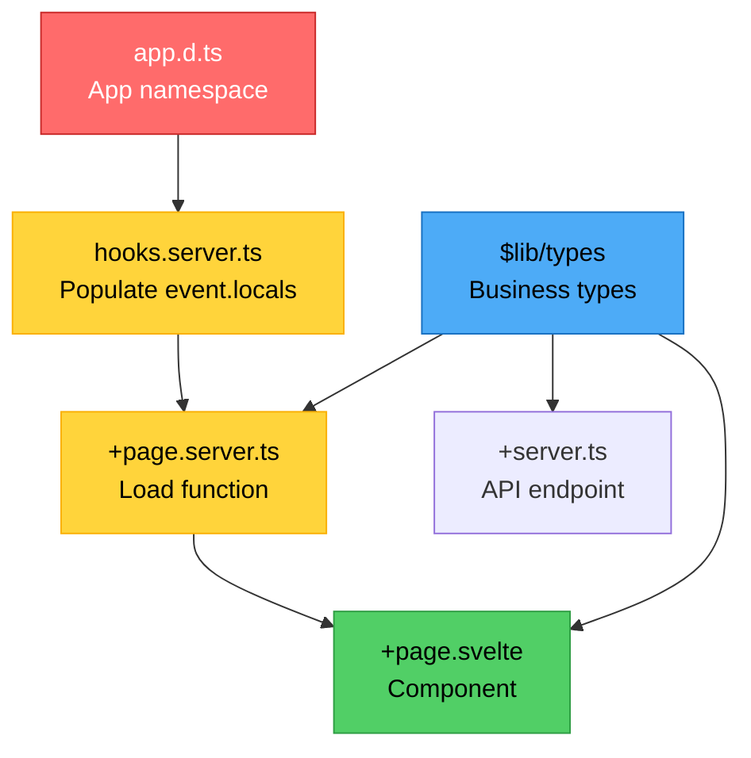

# Project Guide for Claude Code

> **Project Workflow Preferences**:
>
> - ✅ Use **Hybrid Workflow** for all schema changes (Drizzle generate + Wrangler apply)
> - ✅ Use **Drizzle Studio** for inspecting local database (`pnpm run db:studio`)
> - ✅ Use **Production Data Import** workflow for debugging customer issues

---

## 📖 Project Documentation

**[DATAFLOW.md](./DATAFLOW.md)** - Complete SvelteKit Data Flow Reference

This visual guide is essential for understanding the project's architecture:

- **Data Flow Diagrams**: See how data moves from `app.d.ts` → `hooks` → `load` → `components`
- **Server vs Client Execution**: Color-coded breakdown of what runs where
- **Load Function Decision Tree**: When to use `+page.server.ts` vs `+page.ts`
- **Server Load → Universal Load Flow**: How data passes between them
- **TypeScript Integration**: Types-first development workflow
- **Authentication Patterns**: Complete auth flow examples
- **Best Practices**: Visual comparison of correct patterns vs anti-patterns

**Use this guide when**:

- Building new features (reference the workflow diagrams)
- Debugging data flow issues (check execution environment)
- Choosing between server/universal load (see decision tree)
- Onboarding new developers (comprehensive visual reference)

**[src/lib/types/README.md](./src/lib/types/README.md)** - Type Organization Guide

Quick reference for organizing TypeScript types in your project:

- **app.d.ts vs $lib/types**: When to use each
- **Type flow patterns**: How types integrate with data flow
- **Domain organization**: Structuring types as your app grows
- **Best practices**: Types-first development approach

---

## 📚 Official LLM Documentation

When you need deep technical reference, these URLs contain complete, up-to-date documentation for the stack:

### Core Framework & Tools

- **Svelte/SvelteKit**: https://svelte.dev/llms-full.txt
- **Svelte MCP Prompts**: https://svelte.dev/docs/mcp/prompts/llms.txt
  - Contains `svelte-task` prompt with workflow instructions
  - Includes documentation index with use cases for each section
  - Specifies autofixer workflow and playground link generation
- **Drizzle ORM**: https://orm.drizzle.team/llms-full.txt
- **Better Auth**: https://www.better-auth.com/llms.txt
- **Vite**: https://vite.dev/llms-full.txt

### Cloudflare Platform

**Core Infrastructure:**

- **Workers** (Runtime): https://developers.cloudflare.com/workers/llms-full.txt
- **Pages** (Deployment): https://developers.cloudflare.com/pages/llms-full.txt
- **Developer Platform**: https://developers.cloudflare.com/developer-platform/llms-full.txt

**Data Storage:**

- **D1** (SQLite Database - we use this!): https://developers.cloudflare.com/d1/llms-full.txt
- **KV** (Key-Value): https://developers.cloudflare.com/kv/llms-full.txt
- **R2** (Object Storage): https://developers.cloudflare.com/r2/llms-full.txt
- **Durable Objects** (Stateful): https://developers.cloudflare.com/durable-objects/llms-full.txt
- **Vectorize** (Vector DB): https://developers.cloudflare.com/vectorize/llms-full.txt

**Async & Messaging:**

- **Queues**: https://developers.cloudflare.com/queues/llms-full.txt
- **Pub/Sub**: https://developers.cloudflare.com/pub-sub/llms-full.txt
- **Workflows** (Orchestration): https://developers.cloudflare.com/workflows/llms-full.txt

**Database Acceleration:**

- **Hyperdrive**: https://developers.cloudflare.com/hyperdrive/llms-full.txt

**AI & ML:**

- **Workers AI**: https://developers.cloudflare.com/workers-ai/llms-full.txt
- **AI Gateway**: https://developers.cloudflare.com/ai-gateway/llms-full.txt

**Media & Assets:**

- **Images** (Optimization): https://developers.cloudflare.com/images/llms-full.txt
- **Stream** (Video): https://developers.cloudflare.com/stream/llms-full.txt
- **Browser Rendering**: https://developers.cloudflare.com/browser-rendering/llms-full.txt

**Advanced Features:**

- **Realtime**: https://developers.cloudflare.com/realtime/llms-full.txt
- **Pipelines**: https://developers.cloudflare.com/pipelines/llms-full.txt
- **Cloudflare for Platforms**: https://developers.cloudflare.com/cloudflare-for-platforms/llms-full.txt
- **Zaraz** (Third-party tools): https://developers.cloudflare.com/zaraz/llms-full.txt
- **Developer Spotlight**: https://developers.cloudflare.com/developer-spotlight/llms-full.txt

> 💡 **Usage**: Fetch these URLs when you need authoritative answers about API signatures, configuration options, or framework conventions. The docs are always up-to-date and maintained by the official teams.

---

## Tech Stack Overview

```
SvelteKit 5 + Cloudflare Workers + D1 (SQLite) + Drizzle ORM
```

**Architecture**:

- Frontend & Backend: SvelteKit (SSR)
- Runtime: Cloudflare Workers (serverless)
- Database: Cloudflare D1 (serverless SQLite)
- ORM: Drizzle ORM (type-safe queries)
- Auth: Better Auth (modern auth framework)
- i18n: Paraglide

---

## Database Access Pattern

### Runtime (Your App)

```typescript
// In +server.ts, hooks.server.ts, or +page.server.ts
const db = event.locals.db; // Database instance from platform binding

// Type-safe queries
const users = await db.select().from(userTable);
```

**How it works**:

1. `hooks.server.ts` → `handleDatabase` creates DB instance from `platform.env.DB`
2. Stored in `event.locals.db`
3. Available in all server code
4. No API keys needed (uses Wrangler binding)

### Database Schema Location

```
src/lib/server/db/
├── schema.ts          # Table definitions (TypeScript)
└── index.ts           # DB factory function
```

### Better Auth Schema Management

**Schema Structure**:

```
src/lib/server/db/schema.ts  # Main schema (Better Auth tables + custom tables)
auth-schema.ts               # Generated by Better Auth CLI (reference/backup)
auth.config.ts               # Better Auth CLI configuration
```

**Updating Better Auth Schema**:

When Better Auth releases updates or you need to regenerate schema:

```bash
# 1. Regenerate Better Auth schema
pnpm run auth:generate
# Creates/updates: auth-schema.ts

# 2. Review changes
cat auth-schema.ts
# Check what changed

# 3. Manually merge if needed
# Update the Better Auth tables section in src/lib/server/db/schema.ts
# Look for the "BETTER AUTH TABLES" comment block

# 4. Generate Drizzle migration
pnpm run db:generate

# 5. Test locally
npx wrangler d1 migrations apply etee --local

# 6. Deploy to production
npx wrangler d1 migrations apply etee --remote
```

**Important Notes**:

- ⚠️ Better Auth CLI generates to `auth-schema.ts`, **never directly modifies** `schema.ts`
- ✅ Better Auth tables are clearly marked in `schema.ts` with comment blocks
- ✅ You control what goes into your main schema - manually copy/merge as needed
- ✅ Keep `auth-schema.ts` in git as reference for future updates
- ✅ Better Auth tables in `schema.ts` are dated (see comments) so you know when to check for updates

---

## 🏆 Default Workflow: HYBRID APPROACH

**Use Drizzle Kit for generation + Wrangler for applying**

This is the recommended approach for all database schema changes.

### Step-by-Step Workflow

#### 1. Edit Schema (TypeScript-first)

```typescript
// src/lib/server/db/schema.ts
export const user = sqliteTable('user', {
	id: text('id').primaryKey(),
	email: text('email').notNull() // ← Add new column
});
```

#### 2. Generate Migration (Auto-SQL)

```bash
pnpm run db:generate
# ✅ Creates: drizzle/migrations/0001_xxx.sql with enforced naming
# ❌ NO .env needed!
```

**What happens**:

1. Wrapper script runs `drizzle-kit generate`
2. Drizzle Kit reads `schema.ts`, compares with previous migrations, auto-generates SQL
3. Script validates migration name follows context boundary convention
4. If name doesn't match pattern, prompts you for meaningful name
5. Pattern: `<context>_<action>_<detail>` (e.g., `auth_add_oauth_providers`)

**Context Boundary Naming Enforcement**:

- ✅ Ensures all migrations have meaningful names
- ✅ Pattern: `<context>_<action>_<detail>`
- ✅ Examples: `auth_add_oauth_providers`, `user_update_profile_fields`, `payment_create_stripe_integration`
- ❌ Rejects random names like `gray_stephen_strange` or `flying_monkey`
- 🔄 Prompts for correction if pattern not followed
- ⚠️ Maximum 3 attempts before requiring manual rename

#### 3. Review Generated SQL (Optional but Recommended)

```bash
cat drizzle/migrations/0001_xxx.sql
# Review the SQL, make adjustments if needed
```

#### 4. Test Locally First

```bash
npx wrangler d1 migrations apply etee --local
pnpm run dev
# Test your changes thoroughly
```

#### 5. Deploy to Production

```bash
npx wrangler d1 migrations apply etee --remote
pnpm run deploy
```

### Why This Approach?

✅ **Auto-generates SQL** (don't write manually)
✅ **Simple auth** (no .env for generation)
✅ **Local testing** (test before production)
✅ **Migration history** (version control friendly)
✅ **Production-safe** (explicit local → remote flow)
✅ **Best of both worlds** (Drizzle + Wrangler)

---

## Alternative Workflows (When Needed)

### Quick Prototyping (Dev Only)

```bash
# Edit schema.ts, then:
pnpm run db:push  # Requires .env, applies directly

# ⚠️ Use only for: rapid prototyping, local experiments
# ❌ Don't use for: production, team projects
```

### Manual SQL Control

```bash
# Create empty migration
npx wrangler d1 migrations create etee "description"

# Write SQL manually
vim drizzle/migrations/0001_xxx.sql

# Apply
npx wrangler d1 migrations apply etee --local
npx wrangler d1 migrations apply etee --remote
```

---

## Database Commands Reference

### Daily Development

```bash
# Start dev server
pnpm run dev                    # Local D1 at .wrangler/state/

# Better Auth schema generation
pnpm run auth:generate          # Generate Better Auth schema to auth-schema.ts

# Generate migration
pnpm run db:generate            # NO .env needed

# Apply locally
npx wrangler d1 migrations apply etee --local

# Apply to production
npx wrangler d1 migrations apply etee --remote

# Deploy app
pnpm run deploy
```

### Database Management

```bash
# List databases
npx wrangler d1 list

# Get info
npx wrangler d1 info etee

# Execute SQL
npx wrangler d1 execute etee --command "SELECT * FROM user" --local
npx wrangler d1 execute etee --command "SELECT * FROM user" --remote

# Export backup
npx wrangler d1 export etee --output backup.sql --remote
```

### Drizzle Studio (Local Database Inspection)

**Primary use**: Inspecting local miniflare D1 database during development

```bash
# ❌ NO API credentials needed for local inspection!

# 1. Make sure dev server created the database
pnpm run dev  # Run once to create .wrangler/state/... database
# Stop with Ctrl+C

# 2. Open Drizzle Studio (auto-detects local database)
pnpm run db:studio              # Opens GUI at http://localhost:4983
```

**How it works**:

- 🤖 **Automatic Database Detection**: `scripts/db-studio-autodetect.mjs` finds the database file automatically
- ✅ **Validation**: Tests connection with `wrangler d1 execute etee --local --command "SELECT 1"`
- 📝 **Config Update**: Auto-updates `drizzle.config.local.ts` with correct path
- 🚀 **Launch**: Starts Drizzle Studio pointing to detected database
- NO manual path configuration needed!
- NO API credentials needed

**Optional: Inspect remote production database**:

```bash
# Requires .env with API credentials (see .env.example)
pnpm run db:studio:remote
```

**Setup .env** (only if you need remote operations):

```bash
# Copy example
cp .env.example .env

# Edit and add your values:
# - CLOUDFLARE_ACCOUNT_ID: Get from `npx wrangler whoami`
# - CLOUDFLARE_DATABASE_ID: Already in wrangler.jsonc
# - CLOUDFLARE_D1_TOKEN: Create at https://dash.cloudflare.com/profile/api-tokens
```

**Use case**: Browse tables, view data, run queries in GUI during local development

---

## Key Concepts

### Drizzle ORM vs Drizzle Kit

| Aspect              | Drizzle ORM               | Drizzle Kit                |
| ------------------- | ------------------------- | -------------------------- |
| **Type**            | Runtime library           | CLI tool                   |
| **Used in**         | Your app code             | Terminal commands          |
| **Needs API keys?** | ❌ No                     | ✅ Yes (for some commands) |
| **Purpose**         | Query database            | Manage schema & migrations |
| **Example**         | `db.select().from(users)` | `pnpm run db:generate`     |

### Which Commands Need .env?

```
❌ NO .env needed:
  - pnpm run db:generate          (reads local files only)
  - npx wrangler d1 ...            (uses wrangler auth)

✅ YES .env needed:
  - pnpm run db:push               (connects to D1)
  - pnpm run db:migrate            (connects to D1)
  - pnpm run db:studio             (connects to D1)
```

### Local vs Remote Database

```
LOCAL (.wrangler/state/):
  - For development testing
  - Created by: pnpm run dev
  - Apply: wrangler d1 migrations apply etee --local

REMOTE (Cloudflare):
  - Production database
  - Created by: wrangler d1 create etee
  - Apply: wrangler d1 migrations apply etee --remote
```

---

## Project Structure

```
src/
├── routes/                      # SvelteKit pages & API
│   ├── +layout.svelte          # Root layout
│   ├── +page.svelte            # Homepage
│   ├── +page.server.ts         # Server data loading
│   └── +server.ts              # API endpoints
├── lib/
│   ├── types/                  # Business logic types (⚠️ NOT app.d.ts types!)
│   │   ├── index.ts            # Domain models, API types, utilities
│   │   └── README.md           # Type organization guide
│   └── server/                 # Server-only code (⚠️ never exposed to client)
│       ├── db/
│       │   ├── schema.ts       # Database schema (TypeScript)
│       │   └── index.ts        # DB factory (createDB)
│       └── auth.ts             # Authentication logic
├── hooks.server.ts             # Request middleware
│   ├── handleDatabase          # Initialize DB from platform.env.DB
│   ├── handleParaglide         # i18n middleware
│   └── handleAuth              # Session validation
└── app.d.ts                    # SvelteKit App namespace types ONLY

drizzle/
└── migrations/                 # SQL migration files (git tracked)
    ├── 0001_initial.sql
    └── meta/                   # Migration metadata

scripts/                        # Automation scripts (Node.js)
└── db-studio-autodetect.mjs   # Auto-detect local D1 for Drizzle Studio

wrangler.jsonc                  # Cloudflare Workers config
drizzle.config.generate.ts      # Migration generation (no .env needed)
drizzle.config.remote.ts        # Remote D1 operations (requires .env)
drizzle.config.local.ts         # Local D1 inspection (auto-generated)
```

### Script Naming Convention

**Context Boundary Naming**: `<context>-<action>-<detail>.mjs`

This naming convention helps maintain clear boundaries and makes it easy to understand what each script does at a glance.

**Pattern Breakdown**:

- `<context>`: What domain/area this script operates in (e.g., `db`, `deploy`, `test`)
- `<action>`: What the script does (e.g., `studio`, `migrate`, `backup`)
- `<detail>`: Specific behavior or variant (e.g., `autodetect`, `remote`, `local`)

**Examples**:

```
✅ db-studio-autodetect.mjs    # Database + Studio + Auto-detection
✅ db-backup-remote.mjs         # Database + Backup + Remote server
✅ deploy-preview-test.mjs      # Deploy + Preview + Test environment
✅ test-e2e-parallel.mjs        # Test + E2E + Parallel execution
```

**Benefits**:

- **Context Clarity**: Immediately understand what area of the system is affected
- **Action Clarity**: Know what operation will be performed
- **Variant Clarity**: Understand specific behavior or configuration
- **Easy Searching**: `ls scripts/db-*` shows all database-related scripts
- **Maintenance**: Clear boundaries make it easy to locate and update scripts

**Bad Examples**:

```
❌ studio.mjs                   # Too vague - studio for what?
❌ autoDetect.mjs               # camelCase inconsistent, unclear context
❌ db_studio.mjs                # Snake_case not preferred for filenames
❌ database-drizzle-studio-automatic-detection.mjs  # Too verbose
```

---

## Drizzle Configuration Files

The project uses **three separate config files** for different purposes:

### 1. drizzle.config.generate.ts (Migration Generation)

**Purpose**: Generate SQL migrations from TypeScript schema
**Credentials**: ❌ NO .env needed
**Connection**: ❌ NO database connection

```bash
pnpm run db:generate
```

**What it does**:

1. Reads `src/lib/server/db/schema.ts` (TypeScript definitions)
2. Compares with previous migrations
3. Generates new SQL migration files
4. Writes to `drizzle/migrations/*.sql`

**Config contains**: Only `schema`, `out`, `dialect`

---

### 2. drizzle.config.remote.ts (Remote Operations)

**Purpose**: Connect to remote Cloudflare D1 database
**Credentials**: ✅ YES - requires .env with API credentials
**Connection**: ✅ YES - connects to Cloudflare D1

```bash
pnpm run db:push           # Push schema to remote
pnpm run db:migrate        # Apply migrations to remote
pnpm run db:studio:remote  # Inspect production database
```

**Config contains**: `schema`, `out`, `dialect`, `driver`, `dbCredentials`

---

### 3. drizzle.config.local.ts (Local Inspection)

**Purpose**: Inspect local miniflare D1 database
**Credentials**: ❌ NO .env needed
**Connection**: ✅ YES - points to local SQLite file
**Auto-Generated**: Updated by `scripts/db-studio-autodetect.mjs`

```bash
pnpm run db:studio  # Inspect local database
```

**Config contains**: `schema`, `dialect`, `dbCredentials` (file: URL)

---

### Config Selection Matrix

| Command            | Config Used   | Needs .env? | Connects to DB? |
| ------------------ | ------------- | ----------- | --------------- |
| `db:generate`      | `generate.ts` | ❌ No       | ❌ No           |
| `db:push`          | `remote.ts`   | ✅ Yes      | ✅ Remote       |
| `db:migrate`       | `remote.ts`   | ✅ Yes      | ✅ Remote       |
| `db:studio:remote` | `remote.ts`   | ✅ Yes      | ✅ Remote       |
| `db:studio`        | `local.ts`    | ❌ No       | ✅ Local        |

---

## Request Flow

```
User Request
    ↓
Cloudflare Workers
    ↓
SvelteKit Request Handler
    ↓
1. handleDatabase()
   → Creates DB from platform.env.DB
   → Stores in event.locals.db
    ↓
2. handleParaglide()
   → i18n processing
    ↓
3. handleAuth()
   → Validates session using event.locals.db
   → Stores user in event.locals.user
    ↓
4. Route Handler (+server.ts / +page.server.ts)
   → Access DB via event.locals.db
   → Access user via event.locals.user
    ↓
Response to User
```

---

## ⚠️ Critical Concept: Migration Files = Source of Truth

### Understanding Database vs Migration Files

```
Migration files control databases, NOT the other way around!

drizzle/migrations/0001_xxx.sql (SOURCE OF TRUTH)
            │
            ├──→ wrangler apply --local  → Local DB (.wrangler/)
            └──→ wrangler apply --remote → Production DB (Cloudflare)
```

**Key Point**: Local and production databases are **completely independent**!

### What Happens If You Manually Alter Local Database?

**Question**: "If I manually edit the local SQLite file, will it affect production?"

**Answer**: ❌ **NO!** Manual changes are **completely ignored**.

**Why?**

```bash
# You manually edit local database
sqlite3 .wrangler/state/.../miniflare-*.sqlite
> ALTER TABLE user ADD COLUMN hacked TEXT;

# Then deploy
npx wrangler d1 migrations apply etee --remote

# What happens?
# 1. Wrangler reads: drizzle/migrations/*.sql files
# 2. Checks: Which migrations already applied to production?
# 3. Applies: Only NEW migration files
# 4. Result: Your manual change to local DB is IGNORED!
```

**Wrangler ONLY reads**:

- Migration SQL files in `drizzle/migrations/`
- `d1_migrations` table (tracks which migrations were applied)

**Wrangler does NOT**:

- ❌ Read local database structure
- ❌ Compare database schemas
- ❌ Sync local to production
- ❌ Detect manual changes

### The ONLY Way to Change Production

```bash
# ✅ CORRECT: Create migration file
1. Edit schema.ts
2. pnpm run db:generate              # Creates migration file
3. npx wrangler d1 migrations apply etee --remote

# ❌ WRONG: Manual database edits
sqlite3 .wrangler/state/.../miniflare-*.sqlite
# These changes only affect local testing, never production!
```

### If Local and Production Get Out of Sync

```bash
# Reset local database (easiest)
rm -rf .wrangler/state/v3/d1/
npx wrangler d1 migrations apply etee --local
# Recreates local DB from migration files
```

**Remember**: You can always recreate local database from migration files!

---

## Important Notes

### Server-Only Code

```typescript
// ✅ Good: Access DB in server functions
export async function load({ locals }) {
	const users = await locals.db.select().from(userTable);
	return { users };
}

// ❌ Bad: Never try to access DB in client code
// DB is only available in:
// - +server.ts
// - +page.server.ts
// - hooks.server.ts
// - src/lib/server/*
```

### Database Instance

```typescript
// ✅ Good: Use event.locals.db
const db = event.locals.db;

// ❌ Bad: Don't try to import db directly
// import { db } from '$lib/server/db';  // This won't work!
```

### Migration Best Practices

1. **Always generate migrations** when schema changes

   ```bash
   pnpm run db:generate
   ```

2. **Test locally first** before production

   ```bash
   npx wrangler d1 migrations apply etee --local
   pnpm run dev  # Test thoroughly
   ```

3. **Commit migration files** to git

   ```bash
   git add drizzle/migrations/
   git commit -m "Add email column to user table"
   ```

4. **Apply to production** after testing
   ```bash
   npx wrangler d1 migrations apply etee --remote
   pnpm run deploy
   ```

---

## Common Tasks

### Adding a New Table

1. Add to schema.ts:

```typescript
export const posts = sqliteTable('posts', {
	id: text('id').primaryKey(),
	title: text('title').notNull(),
	content: text('content'),
	userId: text('user_id').references(() => user.id)
});
```

2. Generate & apply:

```bash
pnpm run db:generate
npx wrangler d1 migrations apply etee --local
# Test, then:
npx wrangler d1 migrations apply etee --remote
```

### Adding Auth to Route

```typescript
// src/routes/dashboard/+page.server.ts
import { redirect } from '@sveltejs/kit';

export async function load({ locals }) {
	if (!locals.user) {
		throw redirect(302, '/login');
	}

	// User is authenticated
	const userData = await locals.db.select().from(userTable).where(eq(userTable.id, locals.user.id));

	return { userData };
}
```

### Creating API Endpoint

```typescript
// src/routes/api/users/+server.ts
import { json } from '@sveltejs/kit';
import { userTable } from '$lib/server/db/schema';

export async function GET({ locals }) {
	const users = await locals.db.select().from(userTable);
	return json(users);
}

export async function POST({ locals, request }) {
	const data = await request.json();
	await locals.db.insert(userTable).values(data);
	return json({ success: true });
}
```

---

## Debugging with Production Data

### When Customer Reports a Bug

Need to reproduce with real production data? Here's the flow:

```bash
# 1. Export production database
npx wrangler d1 export etee --remote --output=./database.sql

# 2. Reset local database
rm -rf .wrangler/state/v3/d1/

# 3. Re-apply migrations (recreate schema)
npx wrangler d1 migrations apply etee --local

# 4. Import only data (skip CREATE TABLE statements)
grep "^INSERT INTO" database.sql > data-only.sql
npx wrangler d1 execute etee --local --file=./data-only.sql

# 5. Debug with production data
pnpm run dev

# 6. Clean up sensitive data
rm database.sql data-only.sql
```

**Important**:

- ❌ You do NOT need to modify `drizzle.config.remote.ts`
- ✅ Just use Wrangler commands
- ⚠️ Don't commit production data to git (`echo "*.sql" >> .gitignore`)

**Quick shortcut** (if you don't care about migration tracking):

```bash
rm -rf .wrangler/state/v3/d1/
npx wrangler d1 execute etee --local --file=./database.sql
pnpm run dev
```

---

## Troubleshooting

### "DB is not defined"

**Cause**: Trying to use database at module level
**Solution**: Always access via `event.locals.db` in request context

### "Cannot find module '$lib/server/db'"

**Cause**: Trying to import server code in client
**Solution**: Server code (`src/lib/server/*`) is only for server-side

### "Migration already applied"

**Cause**: Migration file already executed
**Solution**: Check migration history with `npx wrangler d1 migrations list etee`

### "Local D1 database not found" error with db:studio

**Cause**: Miniflare hasn't created the database yet
**Solution**:

1. Run `pnpm run dev` or `pnpm run preview` first
2. The dev/preview server creates the database in `.wrangler/state/`
3. Stop the server with Ctrl+C
4. Run `pnpm run db:studio` again

### "Database exists but is not accessible" error

**Cause**: Wrangler configuration mismatch
**Solution**:

1. Check `wrangler.jsonc` has correct `d1_databases` configuration
2. Ensure `database_name` is "etee"
3. Verify `binding` is "DB"

---

## Code Quality & Git Hooks

### Pre-Commit Hooks (Automatic)

**What happens on `git commit`**:

1. Husky triggers pre-commit hook
2. Lint-staged runs on staged files only
3. Auto-fixes issues when possible
4. Blocks commit if unfixable errors found

**Checks performed**:

```bash
# JavaScript/TypeScript/Svelte files:
- prettier --write        # Auto-format code
- eslint --fix           # Auto-fix linting issues

# JSON/Markdown/CSS/HTML files:
- prettier --write        # Auto-format

# Svelte files (additional):
- svelte-check           # Type checking
```

**Configuration**:

- Pre-commit hook: `.husky/pre-commit`
- Lint rules: `package.json` → `lint-staged`
- Skip hooks: `git commit --no-verify` (not recommended)

**Manual commands** (run without commit):

```bash
pnpm run lint      # Check for issues (no auto-fix)
pnpm run format    # Format all files
pnpm run check     # TypeScript + Svelte type checking
```

---

## TypeScript Type Organization

### Understanding Type Locations

**Critical Distinction**: `app.d.ts` vs `$lib/types` serve completely different purposes.

### app.d.ts (SvelteKit Ambient Types ONLY)

Use `app.d.ts` **exclusively** for the `App` namespace:

```typescript
// app.d.ts
import type { User } from '$lib/types';

declare global {
	namespace App {
		// Data available in event.locals (populated by hooks)
		interface Locals {
			user: User | null;
			db: Database;
		}

		// Custom error shape for handleError
		interface Error {
			message: string;
			code?: string;
		}

		// Page data type (from load functions)
		interface PageData {
			// Leave empty or add shared page data type
		}

		// Platform bindings (Cloudflare Workers)
		interface Platform {
			env: {
				DB: D1Database;
			};
		}
	}
}

export {};
```

**What goes here**:

- ✅ `App.Locals` - Data flowing through `event.locals`
- ✅ `App.Error` - Custom error shapes
- ✅ `App.PageData` - Shared page data types
- ✅ `App.Platform` - Platform-specific bindings

**What does NOT go here**:

- ❌ Domain models (User, Post, Product)
- ❌ API request/response types
- ❌ Component prop types
- ❌ Utility types
- ❌ Any non-App namespace types

### $lib/types (Business Logic Types)

Use `src/lib/types/` for **all other types**:

```typescript
// src/lib/types/index.ts
export interface User {
	id: string;
	email: string;
	name: string;
	role: 'admin' | 'user';
}

export interface Post {
	id: string;
	title: string;
	content: string;
	authorId: string;
}

export interface ApiResponse<T = unknown> {
	success: boolean;
	data?: T;
	error?: string;
}

export type LoadingState = 'idle' | 'loading' | 'success' | 'error';
```

**What goes here**:

- ✅ Domain models and entities
- ✅ API request/response shapes
- ✅ Component prop types
- ✅ Utility types and type helpers
- ✅ Enums and constants
- ✅ Type guards and validators

### Usage Patterns

**In Server Functions**:

```typescript
// +page.server.ts
import type { PageServerLoad } from './$types';
import type { User, Post } from '$lib/types';

export const load: PageServerLoad = async ({ locals }) => {
	// locals.user is typed via App.Locals in app.d.ts
	const user: User | null = locals.user;

	// Import business types from $lib/types
	const posts: Post[] = await locals.db.select().from(postsTable);

	return {
		user,
		posts
	};
};
```

**In Components**:

```svelte
<script lang="ts">
	import type { User, Post, LoadingState } from '$lib/types';
	import type { PageProps } from './$types';

	let { data }: { data: PageProps } = $props();
	let loadingState: LoadingState = $state('idle');
</script>
```

**In API Endpoints**:

```typescript
// +server.ts
import type { RequestHandler } from './$types';
import type { ApiResponse, User } from '$lib/types';

export const GET: RequestHandler = async ({ locals }) => {
	const response: ApiResponse<User> = {
		success: true,
		data: locals.user
	};

	return json(response);
};
```

### Type Organization Best Practices

1. **Types-First Development**: Define types before implementation (see DATAFLOW.md)
2. **Explicit Imports**: Use `import type` for type-only imports
3. **Domain Separation**: Organize types by domain as app grows
4. **Documentation**: Add JSDoc comments for complex types
5. **Type Safety**: Leverage TypeScript inference, avoid `any`

### Organizing Types by Domain

As your application grows, organize `$lib/types/` by domain:

```
src/lib/types/
├── index.ts              # Re-export all types
├── auth.ts               # Authentication types
├── user.ts               # User domain types
├── post.ts               # Post domain types
├── api.ts                # API request/response types
└── common.ts             # Shared utility types
```

Then re-export from `index.ts`:

```typescript
// src/lib/types/index.ts
export * from './auth';
export * from './user';
export * from './post';
export * from './api';
export * from './common';
```

### Type Flow in SvelteKit



**Key Points**:

- 🔴 **app.d.ts** → Types for SvelteKit framework integration
- 🔵 **$lib/types** → Types for business logic
- 🟡 **Hooks & Load** → Use both app.d.ts and $lib/types
- 🟢 **Components** → Primarily use $lib/types

For visual data flow understanding with types, see **[DATAFLOW.md](./DATAFLOW.md)**.

For detailed type organization guide, see **[src/lib/types/README.md](./src/lib/types/README.md)**.

---

## When Creating New Features

1. ✅ **Define types first** ($lib/types/index.ts)
2. ✅ **Define schema** (schema.ts)
3. ✅ **Generate migration** (db:generate)
4. ✅ **Test locally** (apply --local)
5. ✅ **Write business logic** (auth.ts, +server.ts)
6. ✅ **Test thoroughly** (pnpm run dev)
7. ✅ **Deploy** (apply --remote, pnpm run deploy)

---

## Summary

**Default workflow**: Hybrid approach (Drizzle generate + Wrangler apply)

**Why**: Best balance of speed, safety, and convenience

**Key tools**:

- `pnpm run db:generate` - Auto-generate SQL from schema
- `npx wrangler d1 migrations apply` - Apply migrations safely
- `event.locals.db` - Access database in server code

**Remember**:

- Database access is server-only
- Always test locally before production
- Commit migration files to git
- Use `event.locals.db`, not direct imports

---

## Additional Resources

- Drizzle ORM Docs: https://orm.drizzle.team
- Cloudflare D1 Docs: https://developers.cloudflare.com/d1
- SvelteKit Docs: https://kit.svelte.dev
- Wrangler CLI: https://developers.cloudflare.com/workers/wrangler

---

_This project follows the hybrid workflow for database migrations. Always generate with Drizzle Kit and apply with Wrangler CLI._
