# SvelteKit Data Flow Guide

A comprehensive visual guide to understanding SvelteKit's data flow, execution environments, and best practices.

---

## Table of Contents

1. [Complete Data Flow Overview](#complete-data-flow-overview)
2. [Server vs Client Execution](#server-vs-client-execution)
3. [When to Use Which Load Function](#when-to-use-which-load-function)
4. [Architecture Layers & Responsibilities](#architecture-layers--responsibilities)
5. [TypeScript Integration Timeline](#typescript-integration-timeline)
6. [Best Practices vs Anti-Patterns](#best-practices-vs-anti-patterns)
7. [Practical Examples](#practical-examples)

---

## Complete Data Flow Overview


**Legend:**

- 🔵 Blue = Type Definitions (compile time)
- 🔴 Red = Server Only (⚙️)
- 🟢 Green = Client/Both (🌐 or ⚙️🌐)

---

## Server vs Client Execution


### Execution Environment Table

| File              | Server | Client | Purpose                                        |
| ----------------- | ------ | ------ | ---------------------------------------------- |
| `app.d.ts`        | ❌     | ❌     | Type definitions only (compile time)           |
| `hooks.server.ts` | ✅     | ❌     | Request interceptor, auth, populate `locals`   |
| `hooks.client.ts` | ❌     | ✅     | Client-side error handling                     |
| `+page.server.ts` | ✅     | ❌     | Server-only data fetching, DB queries, secrets |
| `+page.ts`        | ✅     | ✅     | Universal load (SSR + client navigation)       |
| `+page.svelte`    | ✅     | ✅     | SSR then hydrates, subsequent client-only      |
| `+layout.svelte`  | ✅     | ✅     | SSR then hydrates, subsequent client-only      |
| Context API       | ❌     | ✅     | Only available after hydration                 |

---

## When to Use Which Load Function

### Server Load (+page.server.ts) vs Universal Load (+page.ts)


### When Server Load Data Flows to Universal Load

**Important:** When you have BOTH `+page.server.ts` and `+page.ts`, the server load runs first, and its return value becomes available as the `data` property in the universal load function:

```mermaid
sequenceDiagram
    participant Browser
    participant ServerLoad as +page.server.ts
    participant UniversalLoad as +page.ts
    participant Component as +page.svelte
    participant DB as Database
    participant API as Public API

    Browser->>ServerLoad: Request /page
    Note over ServerLoad: ⚙️ SERVER ONLY
    ServerLoad->>DB: Query database
    DB-->>ServerLoad: { dbData }
    ServerLoad-->>UniversalLoad: return { dbData }

    Note over UniversalLoad: ⚙️🌐 RUNS ON SERVER (SSR)
    UniversalLoad->>UniversalLoad: Receives data.dbData
    UniversalLoad->>API: fetch public API
    API-->>UniversalLoad: { apiData }
    UniversalLoad-->>Component: return { dbData, apiData }

    Component->>Browser: Rendered HTML

    Note over Browser: User clicks link
    Browser->>UniversalLoad: Client navigation
    Note over UniversalLoad: 🌐 RUNS ON CLIENT
    UniversalLoad->>API: fetch public API
    API-->>UniversalLoad: { apiData }
    UniversalLoad-->>Component: { apiData only }
```



### Use Cases

#### ✅ Use Server Load (`+page.server.ts`) When:

- **Database Access**: Direct queries to PostgreSQL, MySQL, MongoDB, etc.
- **Private Environment Variables**: `DATABASE_URL`, `SECRET_KEY`, `API_SECRET`
- **Filesystem Operations**: Reading server files, file uploads
- **Authentication**: Session validation, JWT verification
- **Server-Side APIs**: Internal microservices, admin-only endpoints

**Example:**

```typescript
// ✅ +page.server.ts
import type { PageServerLoad } from './$types';
import { db } from '$lib/server/db';
import { SECRET_API_KEY } from '$env/static/private';

export const load: PageServerLoad = async ({ locals }) => {
	// ✅ Safe: Database access
	const posts = await db.query.posts.findMany();

	// ✅ Safe: Private API key
	const data = await fetch('https://api.internal.com', {
		headers: { Authorization: `Bearer ${SECRET_API_KEY}` }
	});

	return { posts, data };
};
```

#### ✅ Use Universal Load (`+page.ts`) When:

- **Public APIs**: REST APIs that don't require secrets
- **Client-Side Navigation**: Data needed on route changes
- **Custom Classes**: Need to return class instances
- **Client State**: Data that should persist during navigation
- **No Secrets**: All data is public and client-safe

**Example:**

```typescript
// ✅ +page.ts
import type { PageLoad } from './$types';

export const load: PageLoad = async ({ fetch, data }) => {
	// ✅ Can access server load data
	console.log(data.posts); // From +page.server.ts

	// ✅ Public API (no secrets)
	const response = await fetch('https://api.public.com/data');
	const publicData = await response.json();

	// ✅ Can return custom class instances
	return {
		...data, // Merge server data
		publicData,
		customInstance: new MyClass(publicData)
	};
};
```

#### ✅ Use BOTH When:

- Server load fetches private data (database, secrets)
- Universal load fetches public data or returns custom classes
- Universal load needs to transform server data

**Example:**

```typescript
// +page.server.ts - Gets private data
export const load: PageServerLoad = async () => {
	return {
		user: await db.getUser(),
		serverTime: Date.now()
	};
};

// +page.ts - Uses server data + adds public data
export const load: PageLoad = async ({ data, fetch }) => {
	const posts = await fetch('/api/public/posts').then((r) => r.json());

	return {
		user: data.user, // From server load
		serverTime: data.serverTime, // From server load
		posts, // From universal load
		customClass: new UserManager(data.user) // Custom class
	};
};
```

### Decision Matrix

| Scenario                | Use               | Why                                           |
| ----------------------- | ----------------- | --------------------------------------------- |
| Query database          | `+page.server.ts` | Database credentials are secrets              |
| Use `DATABASE_URL`      | `+page.server.ts` | Environment variable is secret                |
| Fetch public API        | `+page.ts`        | No secrets, benefits from client-side caching |
| Return class instance   | `+page.ts`        | Can't serialize classes                       |
| Access filesystem       | `+page.server.ts` | Filesystem only exists on server              |
| Need data on client nav | `+page.ts`        | Universal load runs on navigation             |
| Combine DB + public API | Both              | Server for DB, universal for API              |

---

## Architecture Layers & Responsibilities

```mermaid
graph TB
    subgraph "1️⃣ TYPE LAYER - app.d.ts"
        T1[Define App.Locals Interface]
        T2[Define App.Error Interface]
        T3[Define App.PageData Interface]
    end

    subgraph "2️⃣ AUTHENTICATION LAYER - hooks.server.ts"
        H1[Verify Session Token]
        H2[Lightweight User Lookup]
        H3[Populate event.locals]
        H4[🚫 NO Heavy Queries]
        H5[🚫 NO Page-Specific Data]
    end

    subgraph "3️⃣ INSTANCE LAYER - lib/server/"
        I1[db.ts - Database Connection<br/>Singleton Pattern]
        I2[auth.ts - Auth Utilities<br/>verifySession, hashPassword]
        I3[Other Singletons<br/>Redis, Email Service]
    end

    subgraph "4️⃣ DATA LAYER - +page.server.ts / +layout.server.ts"
        D1[Check Authorization]
        D2[Heavy Database Queries]
        D3[API Calls]
        D4[Data Processing]
        D5[Return Serializable Data]
    end

    subgraph "5️⃣ UNIVERSAL LAYER - +page.ts / +layout.ts"
        U1[Public API Calls]
        U2[Client-Safe Operations]
        U3[🚫 NO Secrets]
        U4[🚫 NO Direct DB Access]
    end

    subgraph "6️⃣ PRESENTATION LAYER - .svelte Components"
        P1[Receive data via props]
        P2[Render UI]
        P3[Handle User Interactions]
        P4[Client-Side State]
    end

    subgraph "7️⃣ CONTEXT LAYER - Component Tree"
        C1[setContext in Parent]
        C2[getContext in Children]
        C3[Share State Down Tree]
    end

    T1 --> H3
    H1 --> H2
    H2 --> H3
    I1 -.Used By.-> H2
    I1 -.Used By.-> D2
    I2 -.Used By.-> H1
    H3 --> D1
    D1 --> D2
    D2 --> D3
    D3 --> D4
    D4 --> D5
    D5 --> P1
    U1 --> P1
    P1 --> P2
    P2 --> P3
    P3 --> P4
    P1 --> C1
    C1 --> C2

    style T1 fill:#4dabf7,stroke:#1971c2,stroke-width:3px,color:#000
    style H4 fill:#ff6b6b,stroke:#c92a2a,stroke-width:3px,color:#fff
    style H5 fill:#ff6b6b,stroke:#c92a2a,stroke-width:3px,color:#fff
    style U3 fill:#ff6b6b,stroke:#c92a2a,stroke-width:3px,color:#fff
    style U4 fill:#ff6b6b,stroke:#c92a2a,stroke-width:3px,color:#fff
```



### Responsibility Matrix

| Layer               | What It Does                                      | What It DOESN'T Do                      |
| ------------------- | ------------------------------------------------- | --------------------------------------- |
| **app.d.ts**        | Define types for `locals`, `error`, page data     | Execute any code                        |
| **hooks.server.ts** | Authenticate user, populate `event.locals`        | ❌ Heavy queries, page-specific data    |
| **lib/server/**     | Database connections, auth utilities (singletons) | ❌ Request-specific logic               |
| **+page.server.ts** | Authorization checks, DB queries, data processing | ❌ Client-side state, UI logic          |
| **+page.ts**        | Public API calls, universal operations            | ❌ Secrets, DB access, server-only code |
| **+page.svelte**    | Render UI, handle interactions                    | ❌ Direct DB access, secrets            |
| **Context**         | Share state down component tree                   | ❌ Work during SSR                      |

---

## Request Lifecycle

```mermaid
sequenceDiagram
    participant Browser
    participant Hooks as hooks.server.ts
    participant Layout as +layout.server.ts
    participant Page as +page.server.ts
    participant Component as +page.svelte
    participant DB as Database

    Browser->>Hooks: GET /dashboard
    Note over Hooks: ⚙️ SERVER
    Hooks->>Hooks: Get session cookie
    Hooks->>DB: verifySession(token)
    DB-->>Hooks: { userId, email, role }
    Hooks->>Hooks: event.locals.user = user

    par Layout Load
        Hooks->>Layout: resolve({ event })
        Note over Layout: ⚙️ SERVER
        Layout->>DB: getSharedData(userId)
        DB-->>Layout: shared data
        Layout-->>Hooks: { user, sharedData }
    and Page Load
        Hooks->>Page: load({ locals })
        Note over Page: ⚙️ SERVER
        Page->>Page: Check authorization
        Page->>DB: getPosts(userId)
        DB-->>Page: posts array
        Page-->>Hooks: { posts }
    end

    Hooks->>Component: Render with merged data
    Note over Component: ⚙️ SERVER (SSR)
    Component->>Component: Generate HTML
    Component-->>Browser: HTML Response

    Note over Browser,Component: 🌐 CLIENT
    Browser->>Component: Hydration
    Component->>Component: Becomes interactive
    Component->>Component: Context available
```



---

## TypeScript Integration Timeline


### Recommended TypeScript Workflow


**Key Principle:** Define types → Build functionality with types → Components automatically typed

---

## Best Practices vs Anti-Patterns

### ✅ CORRECT: Separation of Concerns

```mermaid
graph TD
    subgraph "✅ BEST PRACTICE"
        BP1[app.d.ts<br/>Define App.Locals]
        BP2[hooks.server.ts<br/>user = verifyToken]
        BP3[+page.server.ts<br/>posts = db.query]
        BP4[+page.svelte<br/>Render data.posts]

        BP1 --> BP2
        BP2 --> BP3
        BP3 --> BP4
    end

    subgraph "❌ ANTI-PATTERN"
        AP1[hooks.server.ts<br/>❌ user = verifyToken<br/>❌ posts = db.query ALL<br/>❌ comments = db.query ALL<br/>❌ analytics = db.query ALL]
        AP2[+page.svelte<br/>Uses data but<br/>loaded unnecessarily]

        AP1 --> AP2
    end

    style BP1 fill:#51cf66,stroke:#2f9e44,stroke-width:3px,color:#000
    style BP2 fill:#51cf66,stroke:#2f9e44,stroke-width:3px,color:#000
    style BP3 fill:#51cf66,stroke:#2f9e44,stroke-width:3px,color:#000
    style BP4 fill:#51cf66,stroke:#2f9e44,stroke-width:3px,color:#000
    style AP1 fill:#ff6b6b,stroke:#c92a2a,stroke-width:3px,color:#fff
    style AP2 fill:#ff6b6b,stroke:#c92a2a,stroke-width:3px,color:#fff
```



### Common Mistakes

| ❌ Anti-Pattern                   | ✅ Best Practice               | Why                            |
| --------------------------------- | ------------------------------ | ------------------------------ |
| Heavy queries in hooks            | Lightweight auth only in hooks | Hooks run on EVERY request     |
| Page-specific data in layout load | Page data in page load         | Layout loads are cached        |
| Secrets in `+page.ts`             | Secrets in `+page.server.ts`   | `.ts` runs in browser          |
| Global state on server            | Use `event.locals`             | Server is shared by all users  |
| Accessing context during SSR      | Use props during SSR           | Context only works client-side |

---

## Practical Examples

### Example 1: Authentication Flow

```typescript
// ✅ STEP 1: Define types (app.d.ts)
declare global {
	namespace App {
		interface Locals {
			user: {
				id: string;
				email: string;
				role: 'admin' | 'user';
			} | null;
			sessionId?: string;
		}

		interface Error {
			message: string;
			code?: string;
		}
	}
}

export {};
```

```typescript
// ✅ STEP 2: Create singleton DB (lib/server/db.ts)
import { drizzle } from 'drizzle-orm/postgres-js';
import postgres from 'postgres';
import { DATABASE_URL } from '$env/static/private';

const client = postgres(DATABASE_URL);
export const db = drizzle(client);
```

```typescript
// ✅ STEP 3: Create auth utilities (lib/server/auth.ts)
import { db } from './db';
import { sessions, users } from './schema';
import { eq } from 'drizzle-orm';

export async function verifySession(token: string) {
	const result = await db
		.select({
			userId: users.id,
			email: users.email,
			role: users.role
		})
		.from(sessions)
		.innerJoin(users, eq(sessions.userId, users.id))
		.where(eq(sessions.token, token))
		.limit(1);

	return result[0] || null;
}
```

```typescript
// ✅ STEP 4: Implement hooks (hooks.server.ts)
import type { Handle } from '@sveltejs/kit';
import { verifySession } from '$lib/server/auth';

export const handle: Handle = async ({ event, resolve }) => {
	const sessionToken = event.cookies.get('session');

	// ✅ Lightweight: Just verify and attach user
	event.locals.user = sessionToken ? await verifySession(sessionToken) : null;

	return resolve(event);
};
```

```typescript
// ✅ STEP 5: Load page data (+page.server.ts)
import type { PageServerLoad } from './$types';
import { db } from '$lib/server/db';
import { posts } from '$lib/server/schema';
import { eq } from 'drizzle-orm';
import { error } from '@sveltejs/kit';

export const load: PageServerLoad = async ({ locals }) => {
	// ✅ Authorization check
	if (!locals.user) {
		throw error(401, 'Unauthorized');
	}

	// ✅ Heavy queries HERE, not in hooks
	const userPosts = await db.query.posts.findMany({
		where: eq(posts.authorId, locals.user.id),
		with: {
			comments: true
		}
	});

	return {
		posts: userPosts
	};
};
```

```svelte
<!-- ✅ STEP 6: Render component (+page.svelte) -->
<script lang="ts">
	import type { PageProps } from './$types';

	let { data }: { data: PageProps } = $props();
</script>

<h1>Welcome {data.user?.email}</h1>

{#each data.posts as post}
	<article>
		<h2>{post.title}</h2>
		<p>{post.comments.length} comments</p>
	</article>
{/each}
```

### Example 2: Context for Shared State

```svelte
<!-- ✅ Parent Layout (+layout.svelte) -->
<script lang="ts">
	import { setContext } from 'svelte';
	import type { LayoutProps } from './$types';

	let { data, children }: LayoutProps = $props();

	// ✅ Pass function to maintain reactivity
	setContext('user', () => data.user);
</script>

<nav>
	{#if data.user}
		<span>Hello, {data.user.email}</span>
	{/if}
</nav>

{@render children()}
```

```svelte
<!-- ✅ Child Component (anywhere deep) -->
<script lang="ts">
	import { getContext } from 'svelte';

	const getUser = getContext<() => App.Locals['user']>('user');
	const user = $derived(getUser());
</script>

{#if user}
	<p>User: {user.email}</p>
{/if}
```

### Example 3: Using Both Server and Universal Load

```typescript
// +page.server.ts - Fetch private data
import type { PageServerLoad } from './$types';
import { db } from '$lib/server/db';

export const load: PageServerLoad = async ({ locals }) => {
	return {
		user: await db.getUser(locals.user.id),
		privateData: await db.getUserSettings(locals.user.id)
	};
};
```

```typescript
// +page.ts - Fetch public data, use server data
import type { PageLoad } from './$types';

export const load: PageLoad = async ({ data, fetch }) => {
	// ✅ Access server load data via 'data' parameter
	console.log(data.user); // From +page.server.ts
	console.log(data.privateData); // From +page.server.ts

	// ✅ Fetch public API
	const posts = await fetch('/api/public/posts').then((r) => r.json());

	return {
		...data, // Merge server data
		posts, // Add public data
		customInstance: new PostManager(posts) // Custom class
	};
};
```

---

## Why TypeScript is Critical

### The Type Safety Chain


### Benefits of Types-First Development

1. **Immediate Feedback**: Errors caught during development, not runtime
2. **IntelliSense**: Auto-completion for all properties
3. **Refactoring Safety**: Rename with confidence
4. **Documentation**: Types serve as living documentation
5. **Team Collaboration**: Clear contracts between layers

### When Types Matter Most


**Without TypeScript:**

- `data.user.email` → Runtime error if `user` is undefined
- `locals.user.id` → No auto-completion, easy typos
- Refactoring = Find/replace with fingers crossed

**With TypeScript:**

- Immediate red squiggles for mistakes
- Auto-completion suggests correct properties
- Refactoring updates all references automatically

---

## Key Takeaways

### 🎯 The Golden Rule

```
Hooks = "WHO is this?" (Lightweight authentication)
Load = "WHAT do they need?" (Heavy data fetching)
Component = "HOW to display it?" (UI rendering)
```

### 🔑 Critical Concepts

1. **Types First**: Define types in `app.d.ts` before implementation
2. **Hooks are Lightweight**: Only authentication and `locals` population
3. **Load Functions are Heavy**: Database queries and data processing
4. **Server vs Client**: Know what runs where
5. **Context After Hydration**: Context only works client-side
6. **No Global State**: Use `event.locals` on server, context on client
7. **TypeScript is Essential**: Catches errors early, enables refactoring
8. **Server Load → Universal Load**: Data flows through `data` parameter

### 📊 Performance Impact


### 🚀 Developer Workflow

```
1. Define types (app.d.ts)
2. Create DB/auth utilities (lib/server/)
3. Implement authentication (hooks.server.ts)
4. Build data loading (+page.server.ts, +page.ts)
5. Create UI components (+page.svelte)
6. Use context for deep props (setContext/getContext)
```

---

## Quick Reference

### When to Use Each File

| Need                            | Use This File                         |
| ------------------------------- | ------------------------------------- |
| Define types for `event.locals` | `app.d.ts`                            |
| Authenticate every request      | `hooks.server.ts`                     |
| Database singleton              | `lib/server/db.ts`                    |
| Page-specific DB queries        | `+page.server.ts`                     |
| Shared data across pages        | `+layout.server.ts`                   |
| Public API calls (no secrets)   | `+page.ts`                            |
| Combine DB + public APIs        | Both `+page.server.ts` and `+page.ts` |
| Render UI                       | `+page.svelte`                        |
| Share state down tree           | Context in `+layout.svelte`           |

### Type Imports

```typescript
// Hooks
import type { Handle } from '@sveltejs/kit';

// Server Load
import type { PageServerLoad } from './$types';
import type { LayoutServerLoad } from './$types';

// Universal Load
import type { PageLoad } from './$types';

// Component Props
import type { PageProps } from './$types';
import type { LayoutProps } from './$types';
```

### Common Patterns

```typescript
// ❌ DON'T: Heavy queries in hooks
export const handle: Handle = async ({ event, resolve }) => {
	event.locals.posts = await db.getAllPosts(); // Every request!
	return resolve(event);
};

// ✅ DO: Lightweight auth only
export const handle: Handle = async ({ event, resolve }) => {
	event.locals.user = await verifySession(event.cookies.get('session'));
	return resolve(event);
};
```

```typescript
// ❌ DON'T: Secrets in universal load
// +page.ts (runs in browser!)
export const load: PageLoad = async () => {
	await fetch('api.example.com', {
		headers: { 'API-KEY': 'secret123' } // Exposed to client!
	});
};

// ✅ DO: Secrets in server load
// +page.server.ts (server only)
export const load: PageServerLoad = async () => {
	await fetch('api.example.com', {
		headers: { 'API-KEY': process.env.API_KEY } // Safe!
	});
};
```

---

## Additional Resources

- [SvelteKit Hooks Documentation](https://svelte.dev/docs/kit/hooks)
- [SvelteKit Load Functions](https://svelte.dev/docs/kit/load)
- [SvelteKit State Management](https://svelte.dev/docs/kit/state-management)
- [TypeScript in SvelteKit](https://svelte.dev/docs/kit/types)
- [Authentication Guide](https://svelte.dev/docs/kit/auth)

---

**Remember**: This architecture exists to keep your app fast, secure, and maintainable. Understanding the flow helps you write better code!
