# Launch Kit 🚀

**Complete edge development toolkit for launching products fast.**

Launch your product with instant deployment, built-in authentication, and serverless database. The only stack that gives you complete edge DX with zero configuration.

## ✨ Features

- ⚡ **SvelteKit 5** - Latest framework with server-side rendering
- 🌐 **Cloudflare Workers** - Serverless edge computing
- 🗄️ **Cloudflare D1** - Serverless SQLite database
- 🔐 **Better Auth** - Modern authentication with email/password
- 📊 **Drizzle ORM** - Type-safe SQL queries with automatic migrations
- 🎨 **Tailwind CSS v4** - Utility-first styling
- ✅ **TypeScript** - Full type safety
- 🧪 **Testing** - Vitest (unit) + Playwright (E2E)
- 🔧 **Auto-formatting** - Prettier + ESLint with pre-commit hooks

---

## 🚀 Quick Start

Get running locally in 2 minutes (no configuration needed):

```bash
# 1. Clone and install dependencies
git clone <your-repo>
cd launch-kit
pnpm install  # or npm install

# 2. Start development server (creates local database automatically)
pnpm run dev

# 3. Open browser
# → http://localhost:5173
```

That's it! The local D1 database is created automatically at `.wrangler/state/`

**Optional**: View database with Drizzle Studio

```bash
pnpm run db:studio
# Opens GUI at http://localhost:4983
```

---

## 📚 Documentation

- **[Data Flow Guide](./DATAFLOW.md)** - Comprehensive visual guide to SvelteKit's data flow, execution environments, and best practices
  - Complete lifecycle diagrams
  - Server vs Client execution breakdown
  - When to use server vs universal load functions
  - TypeScript integration patterns
  - Real-world examples with authentication flow

- **[Type Organization Guide](./src/lib/types/README.md)** - TypeScript type organization patterns
  - app.d.ts vs $lib/types: when to use each
  - Type flow with data flow
  - Best practices for types-first development
  - Examples and usage patterns

---

## 📐 Architecture Overview

```mermaid
graph TB
    subgraph "Your Computer (Local)"
        Dev[SvelteKit Dev Server<br/>localhost:5173]
        LocalDB[(Local D1 Database<br/>.wrangler/state/)]
        Studio[Drizzle Studio<br/>localhost:4983]
        Dev --> LocalDB
        Studio --> LocalDB
    end

    subgraph "Cloudflare Edge (Production)"
        Worker[Cloudflare Workers<br/>your-app.workers.dev]
        ProdDB[(Production D1<br/>Cloudflare)]
        Worker --> ProdDB
    end

    User[👤 User] --> Dev
    User --> Worker

    Deploy[pnpm run deploy] -.->|Deploy Code| Worker
    Migrate[wrangler d1 migrations apply] -.->|Apply Migrations| ProdDB

    style Dev fill:#c084fc,stroke:#333,color:#000
    style LocalDB fill:#60a5fa,stroke:#333,color:#000
    style Worker fill:#4ade80,stroke:#333,color:#000
    style ProdDB fill:#22d3ee,stroke:#333,color:#000
```



**Key Concepts**:

- 🏠 **Local**: Your development environment (no configuration needed)
- ☁️ **Production**: Cloudflare's global edge network
- 📊 **Two Databases**: Local for development, Production for users (completely separate)
- 🚀 **Deploy Flow**: Code and database migrations are deployed separately

---

## 🔄 Development Workflow

Understanding the development cycle is key. Here's what to do at each stage:

```mermaid
graph LR
    A[1. Daily Dev<br/>pnpm run dev] --> B[2. Schema Changes<br/>Edit schema.ts]
    B --> C[3. Generate Migration<br/>pnpm run db:generate]
    C --> D[4. Apply Locally<br/>wrangler apply --local]
    D --> E[5. Test<br/>pnpm run test]
    E --> F[6. Commit & Push<br/>git commit]
    F --> G[7. Deploy DB<br/>wrangler apply --remote]
    G --> H[8. Deploy Code<br/>pnpm run deploy]
    H --> I[✅ Live on Cloudflare]

    E -.->|Issues Found| B

    style A fill:#93c5fd,stroke:#333,color:#000
    style B fill:#fcd34d,stroke:#333,color:#000
    style C fill:#fcd34d,stroke:#333,color:#000
    style D fill:#fcd34d,stroke:#333,color:#000
    style E fill:#f9a8d4,stroke:#333,color:#000
    style F fill:#86efac,stroke:#333,color:#000
    style G fill:#fca5a5,stroke:#333,color:#000
    style H fill:#fca5a5,stroke:#333,color:#000
    style I fill:#4ade80,stroke:#333,color:#000
```



### 1. Daily Development (Local Environment)

**What you're doing**: Building features, testing locally

```bash
pnpm run dev          # Start dev server (local D1 database)
```

**Key concepts**:

- ✅ Changes to code auto-reload instantly
- ✅ Local database at `.wrangler/state/` (gitignored)
- ✅ No .env file needed for local development
- ✅ Authentication works out of the box locally

**When you need it**: Every day while coding

> 💡 **Tip: TypeScript Types for Cloudflare Bindings**
>
> After you add new bindings to `wrangler.jsonc` (D1 databases, KV namespaces, R2 buckets, etc.), regenerate TypeScript types:
>
> ```bash
> pnpm run cf-typegen
> ```
>
> This updates `src/worker-configuration.d.ts` so you get autocomplete and type safety for `platform.env.*` in your code.
>
> **When to run**: After modifying bindings in `wrangler.jsonc`

---

### 2. Database Schema Changes

**What you're doing**: Adding new tables or modifying existing ones

```bash
# Step 1: Edit your schema
# File: src/lib/server/db/schema.ts
# Add your table after the Better Auth section

# Step 2: Generate migration (enforces meaningful naming)
pnpm run db:generate
# Prompts: "Enter migration name: user_add_profile_fields"
# Creates: drizzle/migrations/0001_user_add_profile_fields.sql

# Step 3: Apply to local database
npx wrangler d1 migrations apply etee --local

# Step 4: Restart dev server to pick up changes
pnpm run dev
```

**Key concepts**:

- ✅ Migration names follow pattern: `<context>_<action>_<detail>`
- ✅ Examples: `auth_add_oauth`, `user_update_fields`, `payment_create_stripe`
- ✅ Migrations are version-controlled SQL files
- ✅ Local → Test → Production workflow

**When you need it**: When adding/modifying database tables

---

### 3. Viewing Database Content

**What you're doing**: Inspecting data, debugging database issues

```bash
pnpm run db:studio    # Auto-detects local database, opens GUI
```

**Key concepts**:

- ✅ No configuration needed (auto-detects database)
- ✅ Browse tables, view data, run queries
- ✅ Works with local database only (safe)

**When you need it**: Debugging, verifying migrations, checking data

---

### 4. Testing Your Changes

**What you're doing**: Running tests before deployment

```bash
pnpm run test:unit    # Vitest unit tests
pnpm run test:e2e     # Playwright E2E tests
pnpm run lint         # Check code quality
pnpm run check        # TypeScript + Svelte validation
```

**Key concepts**:

- ✅ Pre-commit hooks run automatically
- ✅ Tests use local database
- ✅ E2E tests simulate real user flows

**When you need it**: Before committing, before deploying

---

### 5. Preview Production Build (Local)

**What you're doing**: Testing production build locally before deploying

```bash
pnpm run preview      # Build + run with Wrangler locally
```

**Key concepts**:

- ✅ Simulates Cloudflare Workers environment
- ✅ Still uses local D1 database
- ✅ Tests production build issues

**When you need it**: Before deploying to catch build issues

---

### 6. Deploying to Cloudflare

**What you're doing**: Pushing your app to Cloudflare's edge network

This project has two environments configured:

#### Deploy to Staging

```bash
pnpm run deploy:staging
# Builds and deploys to: gachapon-player-frontend-staging.workers.dev
```

**Use for**: Testing features before production release

#### Deploy to Production

```bash
pnpm run deploy:prod
# Builds and deploys to: gachapon-player-frontend-production.workers.dev
```

**Use for**: Shipping features to users

**Key concepts**:

- ✅ Staging environment for testing before production
- ✅ Production environment for live users
- ✅ Changes are live immediately on workers.dev
- ✅ Use mock data services (no database migrations needed)

**When you need it**: Shipping features to staging or production

---

## 🔐 Authentication Flow


**Key Points**:

- 🔐 Sessions stored in D1 database
- 🍪 Cookies managed automatically
- ⏱️ Sessions expire after 30 days (configurable)
- 🔄 Auto-refresh if older than 15 days

> 💡 **Tip: Updating Better Auth Schema**
>
> When Better Auth releases updates or you need to regenerate schema:
>
> 1. `pnpm run auth:generate` → Creates `auth-schema.ts`
> 2. Review what changed in `auth-schema.ts`
> 3. **Manually copy** relevant changes to `src/lib/server/db/schema.ts` (BETTER AUTH TABLES section)
> 4. `pnpm run db:generate` → Create migration
> 5. `npx wrangler d1 migrations apply etee --local` → Test locally
> 6. `npx wrangler d1 migrations apply etee --remote` → Deploy to production
>
> ⚠️ `auth-schema.ts` is reference only - `schema.ts` is the single source of truth!

---

## 🌍 Deployment to Cloudflare

🚀 **Deployment Guide - Gachapon Player Frontend**

First-time deployment setup (one-time process):

### Prerequisites

- Cloudflare account (free tier available)
- Wrangler CLI (included in project dependencies)

### Step 1: Authenticate with Cloudflare

```bash
npx wrangler login
# Opens browser, authorize access
```

### Step 2: Deploy to Staging (First Deployment)

```bash
pnpm run deploy:staging
# Builds and deploys to Cloudflare Workers
# Output shows: https://gachapon-player-frontend-staging.YOUR-SUBDOMAIN.workers.dev
```

### Step 3: Test Staging Environment

Visit your staging URL and verify:

- ✅ App loads correctly
- ✅ Mock authentication works (`?token=user1_token`)
- ✅ All features functional with mock data

### Step 4: Deploy to Production (When Ready)

```bash
pnpm run deploy:prod
# Builds and deploys to production
# Output shows: https://gachapon-player-frontend-production.YOUR-SUBDOMAIN.workers.dev
```

### Step 5: Monitor Deployment

Check deployment status:

```bash
# View staging logs
npx wrangler tail --env staging

# View production logs
npx wrangler tail --env production
```

### Deployment Flow Diagram

```mermaid
graph TD
    A[Local Development Done] --> B{All tests passing?}
    B -->|No| C[Fix issues]
    C --> B
    B -->|Yes| D[git commit & push]
    D --> E[Deploy to Staging]
    E --> F[pnpm run deploy:staging]
    F --> G{Build successful?}
    G -->|No| H[Fix build errors]
    H --> D
    G -->|Yes| I[✅ Live on Staging]
    I --> J[Test staging environment]
    J --> K{Everything working?}
    K -->|No| L[Debug and fix]
    L --> D
    K -->|Yes| M[Deploy to Production]
    M --> N[pnpm run deploy:prod]
    N --> O{Build successful?}
    O -->|No| P[Check build errors]
    O -->|Yes| Q[✅ Live on Production]
    Q --> R[Test production environment]
    R --> S{Everything working?}
    S -->|No| T[Check logs & rollback if needed]
    S -->|Yes| U[🎉 Deployment Complete]

    style A fill:#93c5fd,stroke:#333,color:#000
    style I fill:#c084fc,stroke:#333,color:#000
    style Q fill:#4ade80,stroke:#333,color:#000
    style U fill:#fbbf24,stroke:#333,color:#000
```



**Remember**: Test on staging before deploying to production!

---

## 🎨 Customization

Make this template your own:

### 1. Rename the Project

**Files to edit**:

```jsonc
// package.json
{
  "name": "your-project-name"  // ← Change this
}

// wrangler.jsonc
{
  "name": "your-project-name"  // ← Change this
}
```

### 2. Rename the Database

**If you want a different database name**:

```jsonc
// wrangler.jsonc
{
	"d1_databases": [
		{
			"database_name": "your-db-name" // ← Change from "etee"
		}
	]
}

// Then update commands:
// npx wrangler d1 migrations apply your-db-name --local
// npx wrangler d1 migrations apply your-db-name --remote
```

**Also update**: `scripts/db-studio-autodetect.mjs` line 12:

```javascript
const DATABASE_NAME = 'your-db-name'; // ← Change this
```

### 3. Add Custom Database Tables

```typescript
// src/lib/server/db/schema.ts
// Add after the Better Auth section (line 95+)

export const posts = sqliteTable('posts', {
	id: text('id').primaryKey(),
	title: text('title').notNull(),
	content: text('content'),
	userId: text('user_id').references(() => user.id),
	createdAt: integer('created_at', { mode: 'timestamp_ms' })
		.default(sql`(cast(unixepoch('subsecond') * 1000 as integer))`)
		.notNull()
});

export type Post = typeof posts.$inferSelect;
```

**Then generate migration**:

```bash
pnpm run db:generate
# Enter name: posts_create_initial
npx wrangler d1 migrations apply etee --local
```

### 4. Update Better Auth Configuration

```typescript
// src/lib/server/auth.ts
// Modify authentication settings:
export function createAuth(db: DB) {
	return betterAuth({
		// ... existing config
		emailAndPassword: {
			enabled: true,
			requireEmailVerification: true, // ← Enable email verification
			sendVerificationEmail: async (user, url) => {
				// Add your email sending logic
			}
		}
	});
}
```

See [AUTH.md](./AUTH.md) for complete authentication customization guide.

---

## 📁 Project Structure

```
my-svelte-app/
├── src/
│   ├── lib/
│   │   ├── types/               # Business logic types (domain models, API types)
│   │   │   ├── index.ts         # Main types file
│   │   │   └── README.md        # Type organization guide
│   │   ├── server/              # Server-only code (never exposed to client)
│   │   │   ├── db/
│   │   │   │   ├── schema.ts   # Database schema (TypeScript)
│   │   │   │   └── index.ts    # DB factory function
│   │   │   └── auth.ts          # Auth factory function
│   │   └── client/
│   │       └── auth.ts          # Client-side auth utilities
│   ├── routes/                  # SvelteKit pages & API endpoints
│   │   ├── +page.svelte        # Homepage
│   │   ├── +layout.svelte      # Root layout
│   │   └── +server.ts          # API endpoints
│   ├── hooks.server.ts          # Request middleware (DB + Auth)
│   └── app.d.ts                 # SvelteKit App namespace types ONLY
│
├── drizzle/
│   └── migrations/              # SQL migration files (version-controlled)
│       ├── 0000_auth_better_auth_initial_setup.sql
│       └── meta/                # Migration metadata
│
├── scripts/                     # Automation scripts
│   ├── db-generate-migration.mjs      # Migration naming enforcement
│   └── db-studio-autodetect.mjs       # Auto-detect local DB for Studio
│
├── drizzle.config.generate.ts   # Migration generation config
├── drizzle.config.remote.ts     # Remote D1 operations config
├── wrangler.jsonc               # Cloudflare Workers config
├── auth.config.ts               # Better Auth CLI config
├── DATAFLOW.md                  # SvelteKit data flow visual guide
├── CLAUDE.md                    # Complete developer workflows guide
└── AUTH.md                      # Authentication system documentation
```

### 📝 TypeScript Type Organization

**Quick reference** for organizing types:

- **app.d.ts** = SvelteKit `App` namespace ONLY (Locals, PageData, Error, Platform)
- **src/lib/types/** = All business logic types (User, Post, API types, utilities)

```typescript
// ✅ app.d.ts - SvelteKit framework types
declare global {
	namespace App {
		interface Locals {
			user: User | null;
			db: Database;
		}
	}
}

// ✅ src/lib/types/index.ts - Business logic types
export interface User {
	id: string;
	email: string;
	name: string;
}
```

See **[src/lib/types/README.md](./src/lib/types/README.md)** for complete type organization guide.

---

## 📚 Detailed Documentation

### For Day-to-Day Development

- **[CLAUDE.md](./CLAUDE.md)** - Complete developer workflows
  - Database management patterns
  - Migration best practices
  - Troubleshooting guide
  - Advanced Drizzle ORM usage
  - Local vs remote workflows
  - Production debugging

### For Authentication

- **[AUTH.md](./AUTH.md)** - Authentication system guide
  - Better Auth architecture
  - Adding OAuth providers
  - Email verification setup
  - Session management
  - Protected routes
  - API authentication

---

## 🛠️ Command Reference

### Development

```bash
pnpm run dev              # Start dev server (local D1)
pnpm run preview          # Preview production build locally
pnpm run build            # Build for production
```

### Database

```bash
pnpm run db:generate      # Generate migration (enforced naming)
pnpm run db:studio        # Open Drizzle Studio (local DB)
pnpm run db:studio:remote # Open Drizzle Studio (production DB, requires .env)

# Wrangler D1 commands
npx wrangler d1 migrations apply etee --local   # Apply to local
npx wrangler d1 migrations apply etee --remote  # Apply to production
npx wrangler d1 execute etee --command "SELECT * FROM user" --local
```

### Authentication

```bash
pnpm run auth:generate    # Regenerate Better Auth schema
```

### Testing & Quality

```bash
pnpm run test:unit        # Run Vitest tests
pnpm run test:e2e         # Run Playwright tests
pnpm run lint             # Run ESLint + Prettier check
pnpm run format           # Auto-format all files
pnpm run check            # TypeScript + Svelte validation
```

### Deployment

```bash
npx wrangler login        # Authenticate with Cloudflare
pnpm run deploy:staging   # Build + deploy to staging
pnpm run deploy:prod      # Build + deploy to production
npx wrangler tail --env staging    # View staging logs
npx wrangler tail --env production # View production logs
```

---

## 🔑 Environment Variables

### Local Development

✅ **NO .env FILE NEEDED** for local development!

Works out of the box:

- `pnpm run dev` (local D1 database)
- `pnpm run db:studio` (local database inspection)
- `pnpm run db:generate` (migration generation)

### Remote Operations (Optional)

Only create `.env` if you need to:

- View production database in Drizzle Studio
- Push schema changes directly (not recommended)

**If needed**, copy `.env.example` and fill in:

```bash
cp .env.example .env
# Edit .env with your Cloudflare credentials
```

See `.env.example` for detailed setup instructions.

---

## 🧪 Testing

### Unit Tests (Vitest)

```bash
pnpm run test:unit
# Fast tests for business logic and utilities
```

### E2E Tests (Playwright)

```bash
pnpm run test:e2e
# Browser tests simulating real user flows
```

### Pre-commit Checks

Git hooks automatically run on commit:

- Prettier formatting
- ESLint fixes
- TypeScript validation
- Svelte validation

To skip hooks (not recommended):

```bash
git commit --no-verify
```

---

## 🚨 Common Issues & Solutions

### "Database not found" when running db:studio

**Solution**: Run `pnpm run dev` first to create the local database, then try again.

### Migration already applied error

**Solution**: Check migration history:

```bash
npx wrangler d1 migrations list etee --local   # Check local
npx wrangler d1 migrations list etee --remote  # Check production
```

### Better Auth CLI fails on Node 25

**Solution**: Better Auth CLI requires Node 24 or earlier:

```bash
nvm use 24  # Switch to Node 24
pnpm run auth:generate
nvm use 25  # Switch back
```

### Changes not reflecting after migration

**Solution**: Restart the dev server:

```bash
# Ctrl+C to stop
pnpm run dev  # Restart
```

More troubleshooting in [CLAUDE.md](./CLAUDE.md#troubleshooting)

---

## 📦 Tech Stack

- **Framework**: SvelteKit 5.43.6
- **Runtime**: Cloudflare Workers
- **Database**: Cloudflare D1 (SQLite)
- **ORM**: Drizzle ORM 0.44.7
- **Auth**: Better Auth 1.3.34
- **Styling**: Tailwind CSS v4
- **Language**: TypeScript 5.9
- **Build Tool**: Vite 7
- **Testing**: Vitest 3 + Playwright 1.56
- **Package Manager**: pnpm (or npm/yarn)

---

## 📝 License

MIT License - feel free to use this template for any project.

---

## 🤝 Contributing

Contributions welcome! Please:

1. Fork the repository
2. Create a feature branch
3. Make your changes (hooks will auto-format)
4. Submit a pull request

---

## 📖 Learn More

- [SvelteKit Documentation](https://kit.svelte.dev)
- [Cloudflare Workers](https://developers.cloudflare.com/workers)
- [Cloudflare D1](https://developers.cloudflare.com/d1)
- [Drizzle ORM](https://orm.drizzle.team)
- [Better Auth](https://www.better-auth.com)

---

**Ready to build?** Start with `pnpm run dev` and see [CLAUDE.md](./CLAUDE.md) for the complete development workflow guide.
