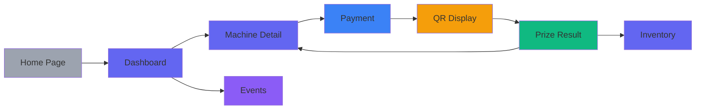

# Complete User Journey Validation

**Date**: November 20, 2025
**Status**: Testing in Progress
**Server**: http://localhost:5173

---

## Complete User Journey (Per PRD Section 4.1)

### ✅ Authentication Flow

**URL**: `/` → `/dashboard?token=mock_token`

**Expected Behavior**:

1. Token extracted from URL parameter
2. Mock auth validates token
3. Session created in D1 database
4. User redirected to dashboard

**Test Results**:

- [ ] Token extraction works
- [ ] Session creation successful
- [ ] User data available in `event.locals.user`
- [ ] Redirect to dashboard correct

---

### 🏠 Dashboard Page

**URL**: `/dashboard`

**Expected Elements**:

- [ ] Navigation header with title
- [ ] Available machines list
- [ ] Machine status badges (AVAILABLE, IN_USE, MAINTENANCE)
- [ ] Featured prizes preview (3 prizes per machine)
- [ ] Price display per play
- [ ] Active events/promotions section
- [ ] Bottom navigation bar

**Test Flow**:

1. **Home → Dashboard**: Click "Launch Dashboard" on home page
2. **Dashboard Display**: Verify all machines load from mock data
3. **Machine Cards**: Each card shows correct information
4. **Navigation**: Bottom nav highlights "Home" tab

**Test Results**:

- [ ] All machines display correctly
- [ ] Status indicators accurate
- [ ] Featured prizes show (top 3)
- [ ] Events section visible
- [ ] Bottom nav functional

---

### 🎰 Machine Selection Flow

**URL**: `/dashboard` → `/machines/[id]`

**Journey Steps**:

1. User clicks machine card on dashboard
2. Navigate to machine detail page
3. Display full machine information
4. Show all available prizes
5. Display event discounts if applicable

**Machine Detail Page Expected**:

- [ ] Machine image and name
- [ ] Location information
- [ ] Full description
- [ ] Complete prize list with rarities
- [ ] Current availability status
- [ ] Play button (if available)
- [ ] Back button navigation

**Test Results**:

- [ ] Machine detail loads correctly
- [ ] All prizes display with rarity badges
- [ ] Navigation from dashboard works
- [ ] Back button returns to dashboard
- [ ] Play button clickable

---

### 💳 Payment Flow

**URL**: `/machines/[id]` → `/machines/[id]/payment`

**Journey Steps**:

1. User clicks "Play Now" on machine detail
2. Navigate to payment preview page
3. Show price breakdown (subtotal, tax, discount)
4. User confirms payment
5. Mock payment processing
6. Navigate to QR generation

**Payment Page Expected**:

- [ ] Machine summary card
- [ ] Price breakdown display:
  - Subtotal (machine price)
  - Tax (6%)
  - Discount (if event active)
  - Total amount
- [ ] Confirm payment button
- [ ] Loading state during processing
- [ ] Error handling for failed payments

**Test Results**:

- [ ] Payment preview loads
- [ ] Price calculations correct
- [ ] Tax calculation (6%) accurate
- [ ] Event discounts apply correctly
- [ ] Confirm button functional
- [ ] Loading spinner shows during processing

---

### 📱 QR Code Generation & Display

**URL**: `/machines/[id]/payment` → `/machines/[id]/qr/[qrId]`

**Journey Steps**:

1. Payment succeeds
2. Generate QR code via mock service
3. Display QR with 2-minute countdown
4. Machine validation simulation
5. Automatic navigation to result page

**QR Page Expected**:

- [ ] Large QR code display (250x250px minimum)
- [ ] 2-minute countdown timer
- [ ] Machine information
- [ ] Instructions for scanning
- [ ] Regenerate button (before expiry)
- [ ] Auto-redirect after scan simulation

**Test Results**:

- [ ] QR code generates successfully
- [ ] Countdown timer functional (120 seconds)
- [ ] QR code displayed clearly
- [ ] Visual countdown indicator
- [ ] Auto-navigation to result works

---

### 🎁 Prize Result Display

**URL**: `/machines/[id]/result/[prizeId]`

**Journey Steps**:

1. Arrive from QR page after scan
2. Display won prize details
3. Show rarity and image
4. Provide post-play actions
5. Add to inventory

**Result Page Expected**:

- [ ] Prize image displayed
- [ ] Prize name and description
- [ ] Rarity badge (COMMON/RARE/LEGENDARY)
- [ ] Post-play action buttons:
  - Play Again → Back to machine detail
  - View Inventory → Navigate to inventory
  - Return to Dashboard → Navigate home

**Test Results**:

- [ ] Prize displays correctly
- [ ] Rarity badge shows
- [ ] All action buttons work
- [ ] Navigation to inventory successful
- [ ] Navigation to dashboard successful
- [ ] "Play Again" returns to machine

---

### 🎉 Events & Promotions

**URL**: `/events`

**Journey Steps**:

1. Navigate from dashboard or bottom nav
2. Browse active events
3. View event details
4. Check participation requirements
5. Track progress (if joined)

**Events List Page Expected**:

- [ ] Active events displayed
- [ ] Event cards show:
  - Event name and description
  - Discount/reward info
  - Participation requirements
  - Progress indicator
  - Time remaining
- [ ] Click to view details

**Event Detail Page** (`/events/[id]`):

- [ ] Full event description
- [ ] Requirements list
- [ ] Reward details
- [ ] Participating machines
- [ ] Available prizes
- [ ] Join/Progress status

**Test Results**:

- [ ] Events list loads
- [ ] Event cards display correctly
- [ ] Navigation to detail works
- [ ] Event requirements clear
- [ ] Progress tracking visible
- [ ] Participating machines listed

---

### 📦 Inventory Management

**URL**: `/inventory`

**Journey Steps**:

1. Navigate from bottom nav or result page
2. View all won prizes
3. Filter by status (Unclaimed/Claimed/Collected)
4. Click prize for details
5. Generate collection QR if physical

**Inventory Page Expected**:

- [ ] Prize grid layout
- [ ] Status indicators:
  - Yellow: Unclaimed (ready to claim)
  - Blue: Claimed (QR generated)
  - Green: Collected (picked up)
- [ ] Prize images and names
- [ ] Tap to view details

**Prize Detail Page** (`/inventory/[id]`):

- [ ] Full prize information
- [ ] Claim status
- [ ] Collection QR code (if claimed)
- [ ] Prize specifications
- [ ] Claim date/time
- [ ] Action buttons based on status

**Test Results**:

- [ ] Inventory displays all prizes
- [ ] Status filtering works
- [ ] Navigation to detail works
- [ ] Collection QR generates
- [ ] Prize information complete

---

## Critical Path Summary

### Complete Journey Checklist

**Core Flow (Must Work)**:

- [ ] 1. Home → Dashboard (auth test)
- [ ] 2. Dashboard → Machine Detail (selection)
- [ ] 3. Machine Detail → Payment (initiate play)
- [ ] 4. Payment → QR Display (payment success)
- [ ] 5. QR Display → Prize Result (scan simulation)
- [ ] 6. Prize Result → Inventory (view collection)

**Secondary Flows**:

- [ ] 7. Dashboard → Events (browse promotions)
- [ ] 8. Events → Event Detail (view requirements)
- [ ] 9. Prize Result → Machine Detail ("Play Again")
- [ ] 10. Prize Result → Dashboard (return home)

**Navigation Tests**:

- [ ] Bottom nav switches between pages correctly
- [ ] Back button navigation works throughout
- [ ] All links and buttons functional
- [ ] No broken routes or 404 errors

---

## Mock Data Validation

### Machines

- [ ] All machines have valid data
- [ ] Featured prizes array populated
- [ ] Status values correct
- [ ] Location strings present

### Events

- [ ] Active events available
- [ ] Requirements defined
- [ ] Rewards configured
- [ ] Participating machines linked

### Inventory

- [ ] Initial inventory items exist
- [ ] Status values valid
- [ ] Prize information complete
- [ ] Images and descriptions present

### Users

- [ ] Mock users configured
- [ ] Test tokens work
- [ ] User roles assigned
- [ ] Session creation functional

---

## Performance Checks

- [ ] Page loads < 3 seconds
- [ ] QR generation < 2 seconds
- [ ] Smooth transitions between pages
- [ ] No console errors
- [ ] No network errors
- [ ] Mock delays realistic (500-2000ms)

---

## Browser/Device Testing

### Desktop Testing

- [ ] Chrome (primary development)
- [ ] Safari
- [ ] Firefox

### Mobile Testing (Responsive)

- [ ] 360px width (small mobile)
- [ ] 375px width (iPhone)
- [ ] 428px width (iPhone Pro Max)
- [ ] Portrait orientation

---

## Unity WebView Preparation

### WebView Detection

- [ ] `isUnityWebView()` function works
- [ ] Unity-specific CSS classes apply
- [ ] Safe area padding considered

### Message Bridge

- [ ] `sendToUnity()` function defined
- [ ] Message types documented
- [ ] Ready to integrate with Unity team

### Navigation

- [ ] Back button behavior appropriate
- [ ] Deep linking support ready
- [ ] Token parameter handling works

---

## Known Limitations (Mock Phase)

1. **Payment Processing**: Simulated, always succeeds after 2s delay
2. **QR Validation**: Auto-succeeds after countdown
3. **Machine Status**: Static, no real-time updates
4. **Events**: Auto-join simulation only
5. **Authentication**: Mock tokens, no real validation

**These will be replaced when backend API is ready.**

---

## Next Steps After Validation

1. ✅ Complete journey validation
2. 🔄 Document any issues found
3. 🔄 Fix critical bugs
4. 🔄 Optimize performance
5. 🔄 Prepare for backend integration
6. 🔄 Add real API client layer
7. 🔄 Test with Unity WebView

---

**Test Conducted By**: Claude Code AI
**Environment**: Local Development (Mock Data)
**Version**: Phase 1 - Frontend MVP
