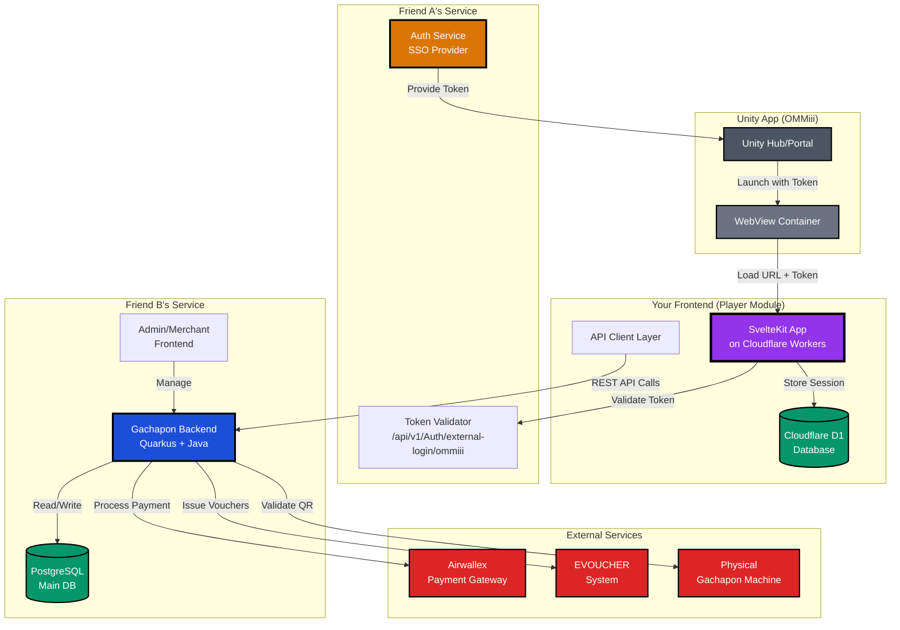
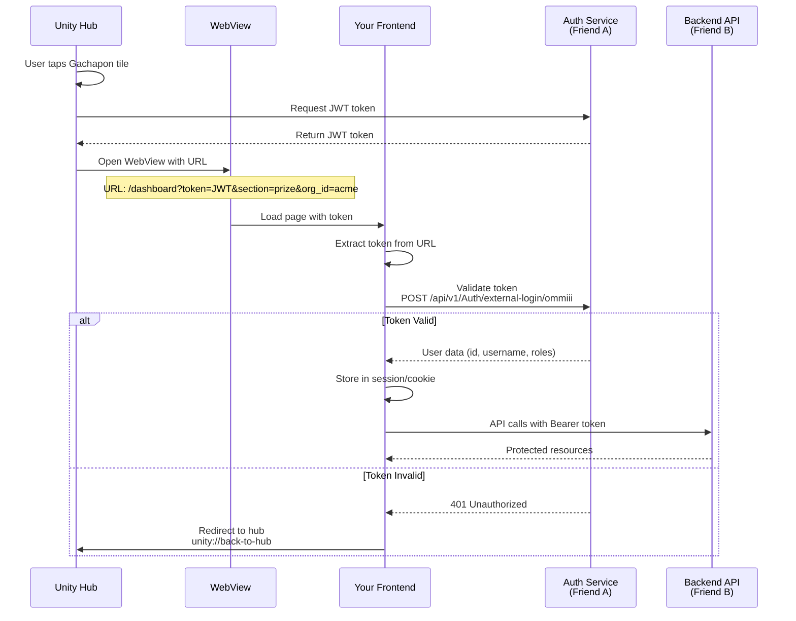
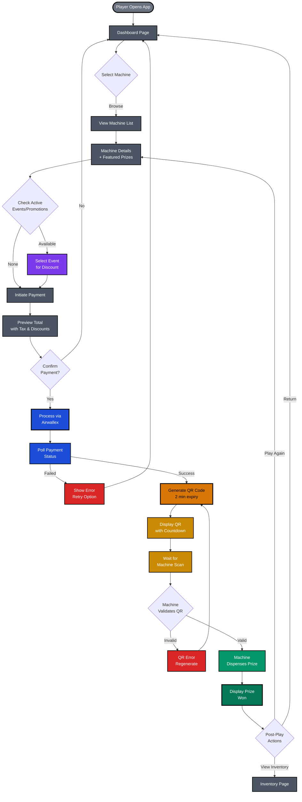
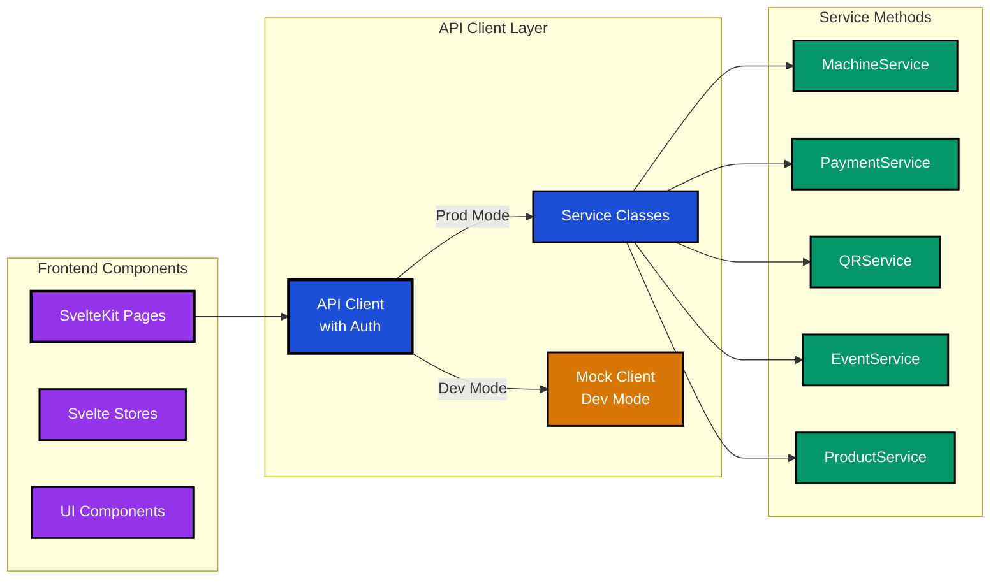
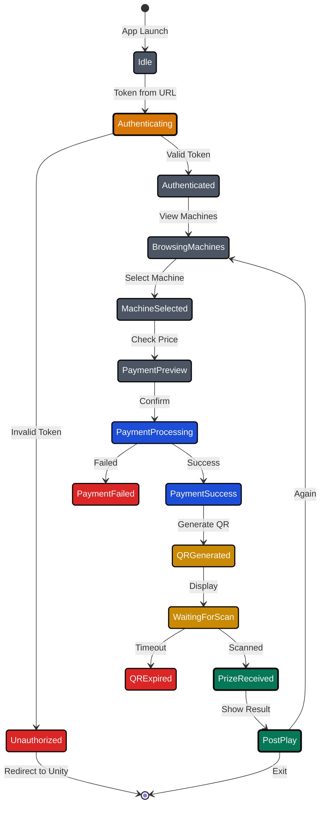

# Gachapon Player Frontend Module - Complete Product Requirements Document

## 1. Executive Summary

### 1.1 Product Overview

A web-based Gachapon player module embedded in the OMMiii Unity App via WebView. This module enables players to interact with physical Gachapon machines through QR codes, manage won prizes, and complete payments. The module is part of a larger ecosystem where authentication, admin, and merchant features are handled by separate teams.

### 1.2 Project Scope & Team Structure

- **You**: Player-facing frontend only (SvelteKit + Cloudflare Workers)
- **Friend A**: Authentication service & JWT token provider
- **Friend B**: Admin/Merchant backend + frontend, main API backend
- **Unity Team**: Hub/Portal app with WebView container

### 1.3 Key Constraints

- **Unity WebView Environment**: Module runs inside Unity app, not standalone
- **Flexible Authentication**: Auth service still in development, support mock tokens
- **No Over-engineering**: Simple, adaptable architecture
- **API Consumer Only**: Frontend consumes APIs, doesn't manage business logic

### 1.4 Success Metrics

- Complete play flow in < 2 minutes
- QR code generation success rate > 95%
- Payment processing success rate > 95%
- Zero WebView crashes on iOS/Android
- Seamless Unity navigation (no browser chrome issues)

---

## 2. System Architecture

### 2.1 High-Level Architecture



### 2.2 Tech Stack

- **Framework**: SvelteKit 5 (SSR for fast initial load)
- **Runtime**: Cloudflare Workers (edge deployment)
- **Database**: Cloudflare D1 (session storage)
- **Styling**: Tailwind CSS v4 (mobile-first)
- **API Client**: TypeScript with service layer pattern
- **Development**: Mock API mode for offline development

---

## 3. Authentication Flow

### 3.1 Sequence Diagram



### 3.2 Token Requirements

- **Format**: JWT Bearer Token
- **Source**: Unity WebView URL parameter
- **Validation**: Friend A's endpoint or mock for dev
- **Storage**: Session cookie (httpOnly, secure)
- **Refresh**: Not required (Unity handles new tokens)

---

## 4. User Journeys

### 4.1 Complete Play Flow



### 4.2 Journey A: First-Time Player

1. **Entry**: Unity Hub → Gachapon tile (not connected) → Connect
2. **Landing**: Auto-authenticate with token from URL
3. **Discovery**: Browse available machines with locations
4. **Tutorial**: First-play overlay explaining QR process
5. **Payment**: RM 5.00 per play confirmation
6. **QR Generation**: 2-minute countdown display
7. **Result**: Prize animation and details
8. **Next Steps**: Play again or view inventory

### 4.3 Journey B: Returning Player Quick Play

1. **Entry**: Unity Hub → Gachapon tile (connected)
2. **Dashboard**: Shows last played machine
3. **Quick Play**: One-tap "Play Again"
4. **Express Payment**: Saved payment method
5. **Instant QR**: Immediate generation after payment
6. **Result**: Quick reveal with options

### 4.4 Journey C: Prize Management

1. **Inventory View**: Grid of won prizes
2. **Categories**: Physical prizes, E-vouchers, Free plays
3. **Physical Prize**: Generate collection QR code
4. **E-voucher**: Copy code or redirect to EVOUCHER
5. **Free Play**: Auto-apply on next purchase

---

## 5. Functional Requirements

### 5.1 Authentication & Session Management

| Requirement         | Details                             |
| ------------------- | ----------------------------------- |
| **Token Source**    | URL parameter from Unity WebView    |
| **Validation**      | POST to Friend A's endpoint or mock |
| **Session Storage** | Cloudflare D1 + secure cookie       |
| **Expiry Handling** | Redirect to Unity on 401            |
| **Mock Support**    | Development mode with test token    |

### 5.2 Machine Discovery

| Requirement         | Details                           |
| ------------------- | --------------------------------- |
| **List Machines**   | GET /api/v1/machines with filters |
| **Machine Details** | GET /api/v1/machines/{id}         |
| **Status Display**  | AVAILABLE, IN_USE, MAINTENANCE    |
| **Auto-refresh**    | Every 30 seconds on dashboard     |
| **Featured Prizes** | Display top 3 prizes per machine  |

### 5.3 Payment Processing

| Requirement | Details                            |
| ----------- | ---------------------------------- |
| **Preview** | Show price with tax and discounts  |
| **Amount**  | RM 5.00 per play (configurable)    |
| **Gateway** | Airwallex integration              |
| **Methods** | Card, e-wallet, vouchers           |
| **Polling** | Check status every 2s, timeout 30s |

### 5.4 QR Code System

| Requirement      | Details                                      |
| ---------------- | -------------------------------------------- |
| **Generation**   | POST /api/v1/user-activity/qr-codes/generate |
| **TTL**          | 2 minutes with visual countdown              |
| **Format**       | AES encrypted JSON, Base64 encoded           |
| **Display**      | Minimum 250x250px for scanning               |
| **Regeneration** | Allow manual refresh before expiry           |

### 5.5 Event/Promotion System

| Requirement           | Details                                           |
| --------------------- | ------------------------------------------------- |
| **Browse Events**     | GET /api/v1/merchant-events                       |
| **Auto-join**         | Backend handles AUTO mode events                  |
| **Manual Join**       | POST /api/v1/merchant-events/join                 |
| **Progress Tracking** | Real-time progress percentage                     |
| **Redemption**        | POST /api/v1/merchant-events/{id}/redeem/{userId} |

### 5.6 Prize Inventory

| Requirement     | Details                             |
| --------------- | ----------------------------------- |
| **View Prizes** | Grid/list toggle view               |
| **Categories**  | Physical, Digital, Vouchers         |
| **Claiming**    | Generate collection QR for physical |
| **Integration** | Link to EVOUCHER for digital        |
| **Status**      | Claimed/Unclaimed indicators        |

---

## 6. Non-Functional Requirements

### 6.1 Performance

- Page load < 3 seconds on 4G
- QR generation < 2 seconds
- API response < 500ms (p95)
- Support 1000 concurrent users
- Offline detection and graceful degradation

### 6.2 Security

- JWT validation on all protected routes
- HTTPS only in production
- QR payload signing to prevent forgery
- Rate limiting: 5 QR/minute, 100 API calls/minute
- No sensitive data in localStorage

### 6.3 Compatibility

- **iOS WebView**: Safari WebKit, iOS 14+
- **Android WebView**: Chrome WebView, Android 8+
- **Screen Sizes**: 360px - 428px width (mobile)
- **Orientation**: Portrait only
- **Unity Integration**: No browser chrome, custom back handling

### 6.4 Accessibility

- Touch targets minimum 44x44px (iOS standard)
- Font size minimum 16px
- High contrast mode support
- Loading states for all actions
- Clear error messages with recovery actions

---

## 7. Page Structure & Components

### 7.1 URL Structure

```
/                           → Redirect to /dashboard
/dashboard                  → Main landing (machine list)
/machines/[id]             → Machine details
/play/[machineId]          → Payment & QR generation
/play/[machineId]/result   → Prize result
/events                    → Active promotions
/inventory                 → Won prizes
/inventory/[prizeId]       → Prize detail & claim
```

### 7.2 Core Components

```
NavigationHeader.svelte    → Unity-aware navigation
MachineCard.svelte        → Machine selection card
QRCodeDisplay.svelte      → QR with countdown
PaymentFlow.svelte        → Payment UI wrapper
PrizeReveal.svelte        → Animated prize display
EventProgress.svelte      → Progress bar for events
InventoryGrid.svelte      → Prize collection view
```

### 7.3 Unity WebView Considerations

- **Back Button**: Disabled on root page (/)
- **Deep Links**: Support ?token=X&section=Y parameters
- **State Preservation**: Handle WebView hide/show
- **Message Bridge**: window.postMessage for Unity communication

---

## 8. API Integration

### 8.1 API Architecture



### 8.2 Core Endpoints (Player Only)

#### No Auth Required

```
GET /api/v1/machines                  → List machines
GET /api/v1/machines/{id}             → Machine details
GET /api/v1/products/featured         → Featured prizes
```

#### Auth Required

```
POST /api/v1/user-activity/qr-codes/generate   → Generate QR
POST /api/v1/payments/preview                  → Preview payment
POST /api/v1/payments                          → Create payment
GET  /api/v1/payments/{id}                     → Payment status
GET  /api/v1/merchant-events                   → Active events
POST /api/v1/merchant-events/join              → Join event
POST /api/v1/merchant-events/{id}/redeem/{userId} → Redeem reward
```

### 8.3 Development Mode

```typescript
// .env.development
VITE_API_BASE_URL=http://localhost:8096/api/v1
VITE_USE_MOCK=true
VITE_MOCK_DELAY=500

// .env.production
VITE_API_BASE_URL=https://api.gachapon.com/api/v1
VITE_USE_MOCK=false
```

---

## 9. State Management

### 9.1 Application State Flow



### 9.2 Store Structure

```typescript
// User store
userStore: {
  id: string;
  username: string;
  token: string;
  roles: string[];
}

// Machine store
machineStore: {
  selected: Machine | null;
  list: Machine[];
  loading: boolean;
}

// Payment store
paymentStore: {
  current: Payment | null;
  status: 'idle' | 'processing' | 'success' | 'failed';
  history: Payment[];
}

// QR store
qrStore: {
  code: string | null;
  expiresAt: Date | null;
  countdown: number;
}
```

---

## 10. UI/UX Guidelines

### 10.1 Design System

- **Primary Color**: Purple (#8B5CF6)
- **Secondary Color**: Pink (#EC4899)
- **Success**: Green (#10B981)
- **Error**: Red (#EF4444)
- **Background**: Gradient (purple-50 to pink-50)

### 10.2 Mobile-First Principles

- **Width Range**: 360px - 428px
- **Touch Targets**: Minimum 44x44px
- **Font Sizes**: Body 16px, Headers 20-24px
- **Spacing**: 16px base unit
- **Buttons**: Full-width on mobile

### 10.3 Loading & Feedback

- **Skeleton loaders** for content
- **Inline spinners** for actions
- **Toast notifications** for success/error
- **Progress bars** for multi-step flows
- **Countdown timers** with visual indicators

### 10.4 Animations

- **Page transitions**: Slide left/right
- **Prize reveal**: Scale + fade animation
- **QR countdown**: Pulsing border
- **Payment processing**: Progress dots
- **Error states**: Subtle shake

---

## 11. Implementation Timeline

### Week 1-2: Foundation

- [ ] Setup SvelteKit with Cloudflare Workers template
- [ ] Implement flexible auth hook (mock + real)
- [ ] Create navigation structure
- [ ] Unity WebView detection
- [ ] Basic dashboard layout
- [ ] API client architecture

### Week 3: Core Features

- [ ] Machine listing and selection
- [ ] Machine detail page
- [ ] QR generation (mock first)
- [ ] QR display with countdown
- [ ] Basic error handling

### Week 4: Payment Flow

- [ ] Payment preview UI
- [ ] Airwallex integration
- [ ] Payment status polling
- [ ] Success/failure handling
- [ ] Voucher system

### Week 5: Events & Inventory

- [ ] Events listing page
- [ ] Event participation tracking
- [ ] Prize inventory grid
- [ ] Collection QR generation
- [ ] EVOUCHER integration prep

### Week 6: Polish & Testing

- [ ] Unity WebView testing (iOS/Android)
- [ ] Performance optimization
- [ ] Error boundary implementation
- [ ] Analytics integration
- [ ] Production deployment

---

## 12. Testing Strategy

### 12.1 Development Testing

```typescript
// Mock token for local development
const MOCK_TOKEN = 'eyJhbGc...'; // Valid JWT structure
const MOCK_USER = {
	id: 'user-123',
	username: 'testplayer',
	roles: ['user']
};
```

### 12.2 Test Scenarios

1. **Auth Flow**: Token validation, expiry, refresh
2. **Machine Selection**: List, filter, select
3. **Payment**: Preview, process, poll, timeout
4. **QR Code**: Generate, display, expire, regenerate
5. **Events**: Browse, join, track, redeem
6. **Unity Integration**: Navigation, back button, deep links

### 12.3 Unity WebView Testing

- Test on real devices (not simulators)
- iOS: iPhone 12+ with iOS 14+
- Android: Pixel 4+ with Android 8+
- Network conditions: 3G, 4G, WiFi
- WebView lifecycle: hide/show, background/foreground

---

## 13. Deployment

### 13.1 Environment Setup

```bash
# Local development
npm run dev

# Build for production
npm run build

# Deploy to Cloudflare
npm run deploy
```

### 13.2 Cloudflare Configuration

```toml
# wrangler.toml
name = "gachapon-player"
main = ".svelte-kit/cloudflare/index.js"
compatibility_date = "2024-01-01"

[site]
bucket = ".svelte-kit/cloudflare"

[[d1_databases]]
binding = "DB"
database_name = "gachapon"
database_id = "xxx"

[vars]
API_BASE_URL = "https://api.gachapon.com/api/v1"
```

---

## 14. Handoff & Integration Points

### 14.1 From Unity Team

- JWT token via URL: `?token=xxx&section=yyy`
- Back button handling via Unity overlay
- App lifecycle events (pause/resume)
- Deep link support

### 14.2 From Auth Team (Friend A)

- Token validation endpoint
- Token structure documentation
- User data format
- Error codes

### 14.3 From Backend Team (Friend B)

- API documentation (provided)
- Postman collection
- WebSocket events (if any)
- Rate limits

### 14.4 To Backend Team

- User agent: "GachaponPlayer/1.0"
- Session tracking headers
- Error reporting format
- Analytics events

---

## 15. Risk Mitigation

| Risk                 | Impact | Mitigation                       |
| -------------------- | ------ | -------------------------------- |
| Auth service delays  | High   | Mock token system ready          |
| Backend API changes  | Medium | Versioned API, adapter pattern   |
| Unity WebView bugs   | High   | Fallback web version             |
| Payment failures     | High   | Multiple retry mechanisms        |
| QR scanning issues   | High   | Manual code entry backup         |
| Network connectivity | Medium | Offline detection, queue actions |

---

## 16. Success Criteria

### Launch Checklist

- [ ] Unity WebView loads without crashes
- [ ] Token authentication works
- [ ] Machines display correctly
- [ ] Payment processes successfully
- [ ] QR codes generate and display
- [ ] Prize results show
- [ ] Inventory accessible
- [ ] No memory leaks after 100 plays

### Post-Launch Metrics

- User completion rate > 80%
- Payment success rate > 95%
- Average play time < 2 minutes
- WebView crash rate < 0.1%
- User rating > 4.0/5.0

---

## 17. Future Enhancements (Phase 2)

- Push notifications for new prizes
- Social sharing of wins
- AR prize preview in Unity
- Loyalty points system
- Multi-language support (BM, EN, CN)
- Offline mode with sync
- Voice-guided tutorial
- Achievement system

---

## Appendices

### A. Unity WebView Communication Protocol

```typescript
// Unity → WebView
{ type: 'token', payload: 'jwt_token' }
{ type: 'navigate', payload: '/path' }
{ type: 'lifecycle', payload: 'pause|resume' }

// WebView → Unity
{ type: 'ready' }
{ type: 'auth_failed' }
{ type: 'navigate_back' }
{ type: 'open_external', payload: 'url' }
```

### B. Error Codes

```typescript
enum ErrorCode {
	AUTH_FAILED = 'E001',
	PAYMENT_FAILED = 'E002',
	QR_EXPIRED = 'E003',
	MACHINE_OFFLINE = 'E004',
	NETWORK_ERROR = 'E005'
}
```

### C. Analytics Events

```typescript
// Track these events
'page_view';
'machine_selected';
'payment_initiated';
'payment_completed';
'qr_generated';
'prize_received';
'error_occurred';
```

---

**Document Version**: 1.0
**Last Updated**: November 2024
**Status**: Ready for Implementation
**Owner**: Player Frontend Team (You)

This PRD is ready to be used with AI coding assistants like Claude for implementation. Each section provides clear requirements and technical specifications for building the Gachapon player module.
