# Project Status & Mock Implementation Flows

**Date**: November 22, 2025
**Purpose**: Comprehensive documentation for Friend A (Auth) and Friend B (Backend) integration
**Status**: ✅ Frontend Complete with Mock Services - Ready for Backend Integration

---

## 📊 Current Project Status

### Implementation Progress

| Component | Status | Notes |
|-----------|--------|-------|
| **Frontend UI** | ✅ 100% | All pages implemented with SvelteKit 5 |
| **Authentication** | ✅ Mock Ready | Friend A integration points defined |
| **Payment Flow** | ✅ Mock Ready | Simplified flow - machine WS handles post-payment |
| **Mock Services** | ✅ Complete | Auth, Payment, QR, WebSocket all functional |
| **Type Contracts** | ✅ Documented | See TYPE_CONTRACTS_FOR_BACKEND.md |
| **Docker Dev Env** | ✅ Working | Hot-reload with Vite HMR |

### What's Working Now

✅ **User can browse machines** - List view with locations
✅ **User can select machine** - Machine detail page
✅ **User can pay** - Payment preview with tax/discounts
✅ **Payment redirects to dashboard** - Shows paid status
✅ **Mock authentication** - JWT tokens, session management
✅ **Mock data** - Machines, users, payments all simulated

### What Needs Backend Integration

⏳ **Friend A (Auth Service)** - Real SSO JWT validation
⏳ **Friend B (Payment API)** - Real payment processing
⏳ **Friend B (Machine API)** - Real machine data from database
⏳ **Friend B (WebSocket)** - Real-time prize notifications

---

## 🔄 Complete User Journey Flow

```mermaid
sequenceDiagram
    participant U as User (Phone)
    participant F as Frontend (SvelteKit)
    participant M as Unity Machine
    participant A as Friend A (Auth)
    participant B as Friend B (Backend)
    participant WS as WebSocket Server

    Note over U,WS: 1. USER OPENS APP FROM UNITY
    M->>F: Launch with JWT token in URL
    F->>A: Validate JWT token
    A-->>F: User session data
    Note over F: Store session in locals

    Note over U,WS: 2. USER BROWSES MACHINES
    F->>B: GET /api/v1/machines
    B-->>F: List of available machines
    Note over F: Display machines with locations

    Note over U,WS: 3. USER SELECTS MACHINE
    U->>F: Click machine
    F->>B: GET /api/v1/machines/:id
    B-->>F: Machine details
    Note over F: Show price, location, theme

    Note over U,WS: 4. USER INITIATES PAYMENT
    U->>F: Click "Play Now"
    F->>F: Navigate to /machines/:id/payment
    F->>B: POST /api/v1/payments/preview
    B-->>F: Payment preview (subtotal, tax, discount, total)
    Note over F: Display payment summary

    Note over U,WS: 5. USER CONFIRMS PAYMENT
    U->>F: Click "Pay"
    F->>B: POST /api/v1/payments
    B-->>F: Payment created (PROCESSING status)

    Note over B: Backend processes payment<br/>with payment gateway

    Note over U,WS: 6. PAYMENT COMPLETES
    B->>B: Payment gateway confirms
    B->>B: Update payment status → SUCCESS
    B->>WS: Notify machine: payment successful
    WS->>M: WebSocket message: unlock dispenser
    Note over M: Machine ready for play

    F->>F: Redirect to /dashboard?paid=true
    Note over F: Show "Payment Successful" indicator

    Note over U,WS: 7. USER PLAYS AT MACHINE
    U->>M: Presses play button
    M->>M: Dispense prize
    M->>B: POST /api/v1/prizes/dispense
    B->>WS: Broadcast prize result
    WS->>F: WebSocket: PRIZE_DISPENSED
    Note over F: Update inventory UI

    Note over U,WS: 8. USER VIEWS PRIZE
    F->>F: Show prize notification
    U->>F: Go to inventory
    F->>B: GET /api/v1/inventory
    B-->>F: User's prize collection
    Note over F: Display prizes
```



---

## 🎯 Simplified Payment Flow (Current Implementation)


---

## 📡 WebSocket Communication Flow


---

## 🔐 Authentication Flow (Friend A Integration)


---

## 💳 Payment Processing Flow (Friend B Integration)

```mermaid
sequenceDiagram
    participant F as Frontend
    participant B as Backend API
    participant PG as Payment Gateway
    participant WS as WebSocket

    Note over F,WS: PAYMENT PREVIEW
    F->>B: POST /api/v1/payments/preview
    Note over F: Body: {<br/>  machineId,<br/>  eventId? (optional)<br/>}
    B->>B: Calculate subtotal, tax, discount
    B-->>F: {subtotal, tax, discount, total}
    Note over F: Display payment summary

    Note over F,WS: PAYMENT INITIATION
    F->>B: POST /api/v1/payments
    Note over F: Body: {<br/>  userId,<br/>  machineId,<br/>  amount<br/>}
    B->>B: Create payment record (PROCESSING)
    B->>PG: Initiate payment
    B-->>F: Payment ID + PROCESSING status
    Note over F: Show loading spinner

    Note over F,WS: PAYMENT GATEWAY PROCESSING
    PG->>PG: Process payment (2-5 seconds)
    PG-->>B: Payment result (SUCCESS/FAILED)

    alt Payment Successful
        B->>B: Update payment → SUCCESS
        B->>WS: Notify machine: unlock dispenser
        WS-->>F: Payment confirmed (optional)
        B-->>F: Redirect to /dashboard?paid=true
    else Payment Failed
        B->>B: Update payment → FAILED
        B-->>F: Error message
        Note over F: Show retry button
    end
```



---

## 🎁 Prize Dispensing Flow


---

## 📦 Mock Services Implementation

### 1. Friend A (Auth Service) Mock

**File**: `src/lib/mocks/services/auth.ts`

**Capabilities**:
- ✅ JWT token generation with proper structure
- ✅ Token validation (format, expiration, signature)
- ✅ Session management (login, logout, refresh)
- ✅ Mock user database with roles

**Mock Users**:
```typescript
user_001: demo.player@example.com (player role)
user_002: vip.player@example.com (player + vip roles)
user_admin: admin@example.com (player + admin roles)
```

**Error Codes**:
- `INVALID_TOKEN` - Token format is invalid
- `TOKEN_EXPIRED` - Token has expired
- `USER_NOT_FOUND` - User does not exist

---

### 2. Friend B (Payment Service) Mock

**File**: `src/lib/mocks/services/payment.ts`

**Capabilities**:
- ✅ Payment preview calculation (subtotal, tax 6%, discounts)
- ✅ Async payment creation (PROCESSING → SUCCESS/FAILED)
- ✅ In-memory payment store
- ✅ Payment status tracking

**Simplified Flow** (Current Implementation):
```typescript
// 1. User clicks "Pay"
const payment = await createPayment(userId, machineId, amount);
// Returns immediately

// 2. Redirect to dashboard
goto('/dashboard?paid=true');

// 3. Machine receives payment via WebSocket (handled by backend)
// Machine unlocks dispenser automatically
```

**Note**: No polling needed in current simplified flow!

---

### 3. WebSocket Mock

**File**: `src/lib/mocks/services/websocket.ts`

**Message Types**:
```typescript
PRIZE_DISPENSED: {
  type: 'PRIZE_DISPENSED',
  qrCodeId: string,
  prizeResult: {
    id: string,
    userId: string,
    machineId: string,
    prize: Prize,
    wonAt: Date
  }
}

QR_SCANNED: {
  type: 'QR_SCANNED',
  qrCodeId: string
}

ERROR: {
  type: 'ERROR',
  qrCodeId: string,
  error: {
    code: string,
    message: string
  }
}
```

---

## 🔧 Integration Checklist for Friend A

### Authentication Integration

- [ ] **Implement JWT validation endpoint**: `POST /api/v1/Auth/validate`
  - Accept: `Authorization: Bearer <token>` header
  - Return: User data + roles OR error

- [ ] **Implement token refresh**: `POST /api/v1/Auth/refresh`
  - Accept: Current JWT token
  - Return: New JWT token OR error

- [ ] **Implement logout**: `POST /api/v1/Auth/logout`
  - Accept: JWT token
  - Return: Success confirmation

### Required Response Formats

See `TYPE_CONTRACTS_FOR_BACKEND.md` for complete TypeScript interfaces.

**Key Type**: `GachaponUser`
```typescript
{
  id: string;
  username: string;  // email
  roles: string[];   // ["player"], ["player", "vip"], etc.
  organizationId: string;
}
```

---

## 🔧 Integration Checklist for Friend B

### Machine API

- [ ] **GET /api/v1/machines** - List all available machines
- [ ] **GET /api/v1/machines/:id** - Get machine details
- [ ] **GET /api/v1/machines/:id/availability** - Check if machine is operational

### Payment API

- [ ] **POST /api/v1/payments/preview** - Calculate payment preview
- [ ] **POST /api/v1/payments** - Create payment (returns PROCESSING)
- [ ] **WebSocket notification** - Notify machine when payment succeeds

### Prize/Inventory API

- [ ] **POST /api/v1/prizes/dispense** - Record dispensed prize (from machine)
- [ ] **GET /api/v1/inventory** - Get user's prize collection
- [ ] **WebSocket broadcast** - Notify frontend when prize dispensed

### WebSocket Server

- [ ] **Payment notifications** - Notify machine to unlock on payment
- [ ] **Prize notifications** - Notify frontend when prize dispensed
- [ ] **Error handling** - Broadcast errors to relevant clients

### Required Response Formats

See `TYPE_CONTRACTS_FOR_BACKEND.md` for complete type contracts.

---

## 📝 Next Steps

### For You (Frontend Developer)

1. ✅ **Current**: All UI pages implemented with mock data
2. ⏭️ **Share documentation**: Send this file + `TYPE_CONTRACTS_FOR_BACKEND.md` to Friend A and Friend B
3. ⏭️ **Coordinate**: Discuss integration timeline and API deployment
4. ⏭️ **Test integration**: Once backends ready, swap mock imports for real API calls
5. ⏭️ **Production deployment**: Deploy to Cloudflare Pages with real backends

### For Friend A (Auth Team)

1. Review `TYPE_CONTRACTS_FOR_BACKEND.md` - Auth section
2. Implement JWT validation endpoint
3. Provide test environment with sample tokens
4. Share API base URL and documentation

### For Friend B (Backend Team)

1. Review `TYPE_CONTRACTS_FOR_BACKEND.md` - Complete API contracts
2. Review this document - Understand complete user journey
3. Implement APIs in priority order:
   - Priority 1: Machine API (browse/select)
   - Priority 2: Payment API (preview/create)
   - Priority 3: WebSocket (payment → machine unlock)
   - Priority 4: Prize API (dispense/inventory)
4. Deploy test environment
5. Share API base URL, WebSocket URL, and documentation

---

## 🔄 Production Migration Path

When backends are ready, simply replace imports:

### Authentication
```typescript
// BEFORE (Mock)
import { validateJWT } from '$lib/mocks/services/auth';

// AFTER (Production)
import { validateJWT } from '$lib/api/auth';
```

### Payment
```typescript
// BEFORE (Mock)
import { createPayment } from '$lib/mocks/services/payment';

// AFTER (Production)
import { createPayment } from '$lib/api/payment';
```

### WebSocket
```typescript
// BEFORE (Mock)
import { usePrizeWebSocket } from '$lib/mocks/services/websocket';

// AFTER (Production)
import { usePrizeWebSocket } from '$lib/api/websocket';
const ws = usePrizeWebSocket('wss://api.example.com/ws/prize-events');
```

**All type contracts remain the same** - no frontend changes needed!

---

## 📚 Related Documentation

- **[PRD.md](./PRD.md)** - Product requirements and system architecture
- **[TYPE_CONTRACTS_FOR_BACKEND.md](./TYPE_CONTRACTS_FOR_BACKEND.md)** - Complete API type contracts for Friend B
- **[PLAYER_API_DOCUMENTATION.md](./PLAYER_API_DOCUMENTATION.md)** - Detailed API endpoint documentation
- **[Gachapon Capsule Machine Module Integration Plan.md](./Gachapon%20Capsule%20Machine%20Module%20Integration%20Plan%20(Embedded%20in%20OMMiii%20App).md)** - Original comprehensive planning document

---

**Status**: ✅ Frontend complete with comprehensive mock services
**Ready for**: Backend integration coordination with Friend A and Friend B
**Last Updated**: November 22, 2025
